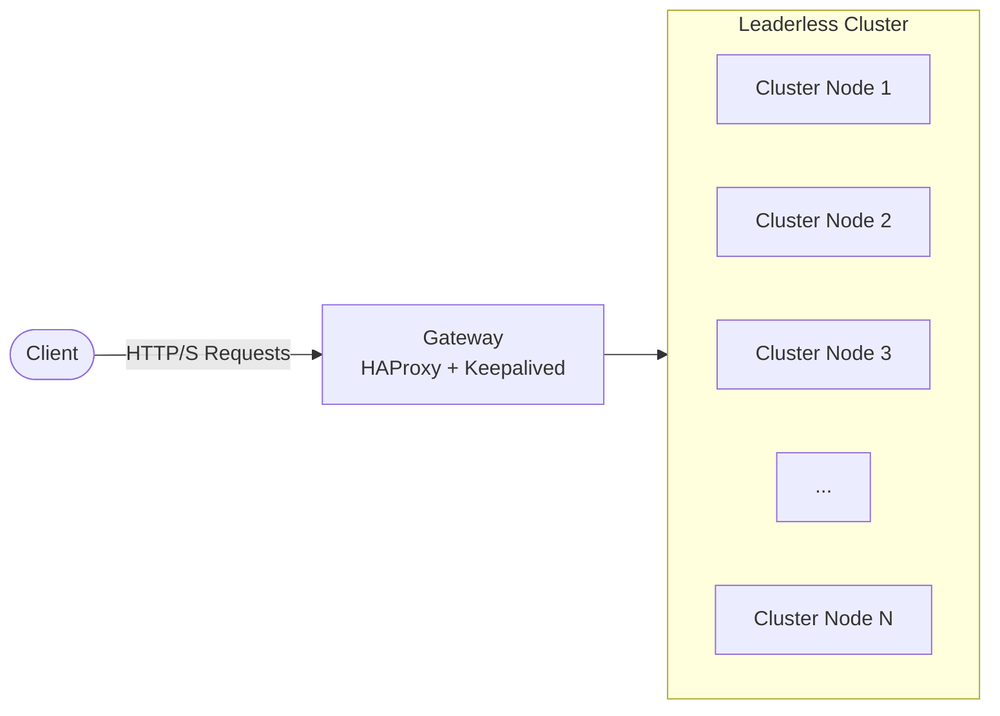
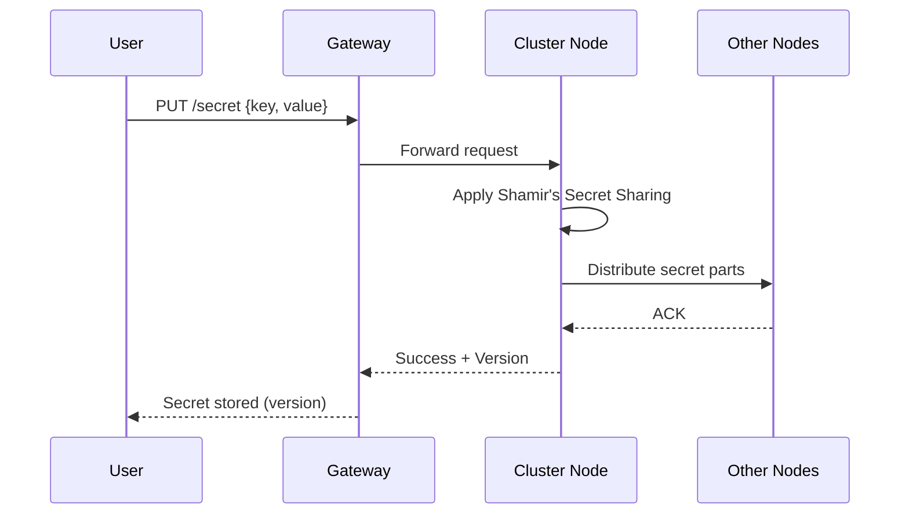
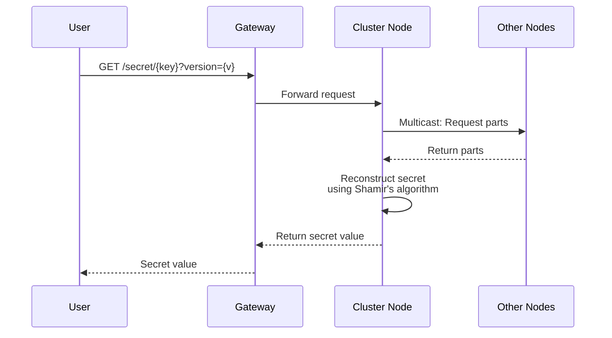
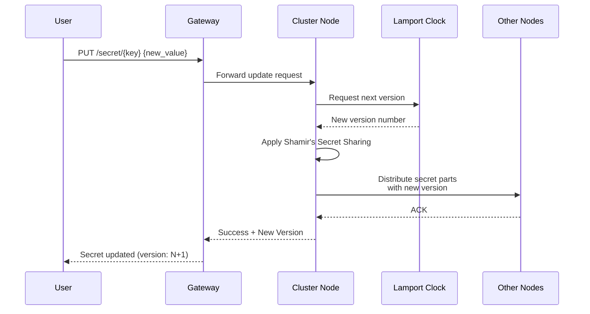
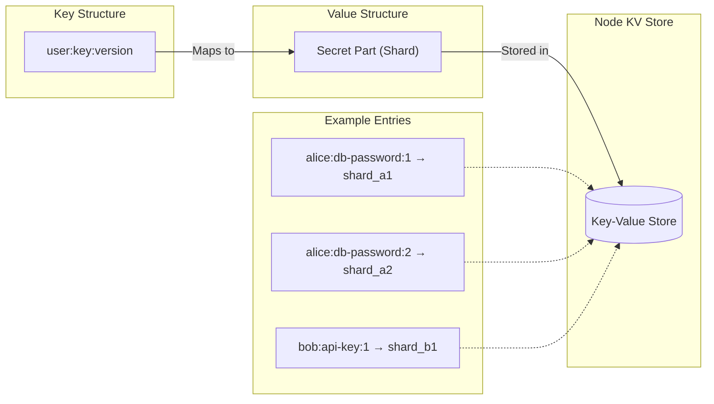
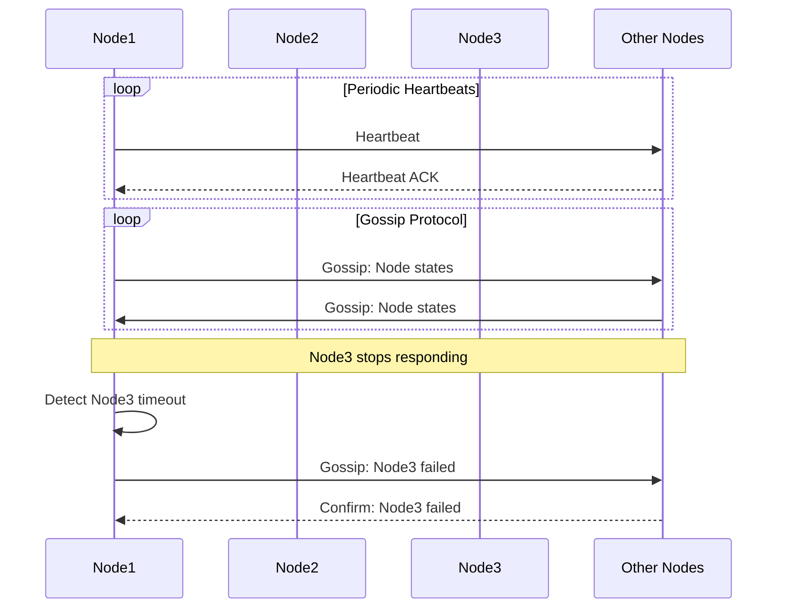

# Distributed Secrets Vault system architecture

1. General architecture

- Client makes requests to the gateway
- Gateway is set up with HAProxy & keepalived
- Gateway sends requests to any node in the cluster (leaderless)

---

2. New user signs up

- TODO: finalize the approach
- Ideas: hash/encrypt user credentials, use a system that doesn't require the user to store credentials (OPAQUE)
- Assume that Oauth2 is set up

---

3. A User puts a secret in the storage

- Send the secret with the secret's key to the cluster
- Cluster uses Shamir's secret sharing algorithm and then spreads parts of the secret

---

4. A user gets a stored secret from the storage

- Request the secret using the secret's unique key and version
- The user may request all versions of a secret, which will return a map of version to secret value
- A cluster member requests all the parts for the requested secret (UDP multicast?)
- The cluster member then rebuilds the secret and returns it to the user

---

5. A user updates a stored secret (version control)

- Each time a secret is updated (or stored), the cluster returns the secret version
- Version is determined using a cluster-wide clock system (Lamport?)
- A user can request either a specific version of the secret or the latest

---

6. Cluster node stores its parts in a map

- Each node stores its part of the secret in a KV store
- Each node maps the user:key:version to the part of the secret

---

7. Node failure detection

- Use logging with heartbeats and gossip to determine node status

---

8. Node failure recovery

- TODO: finalize the approach
