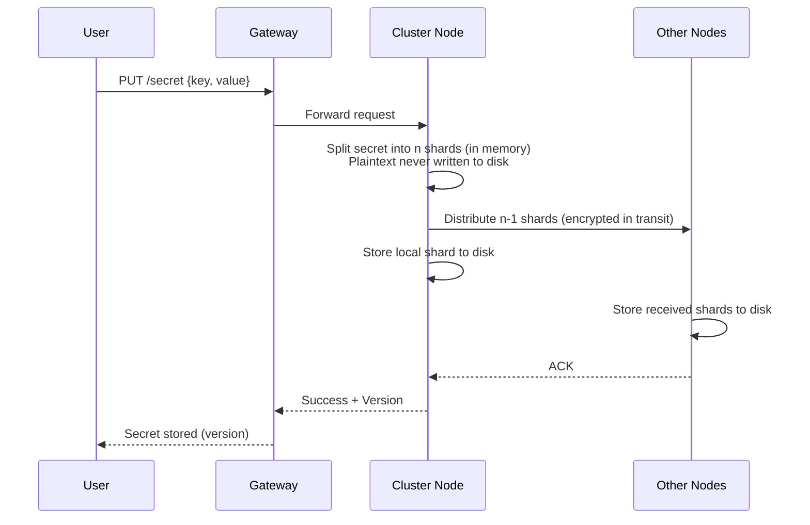
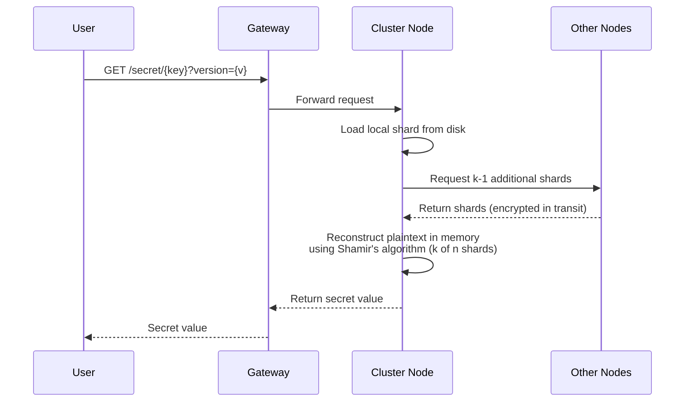
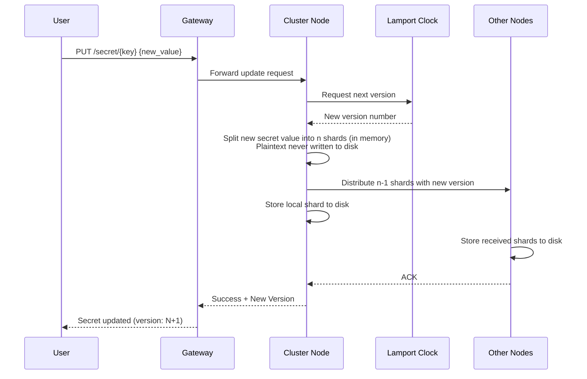
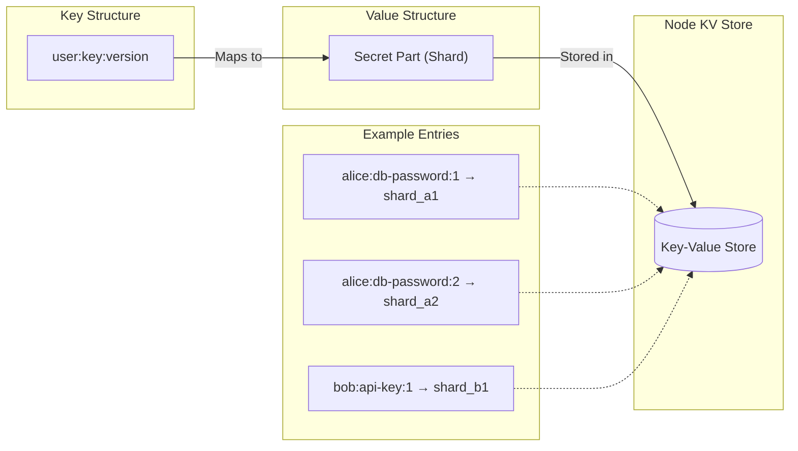
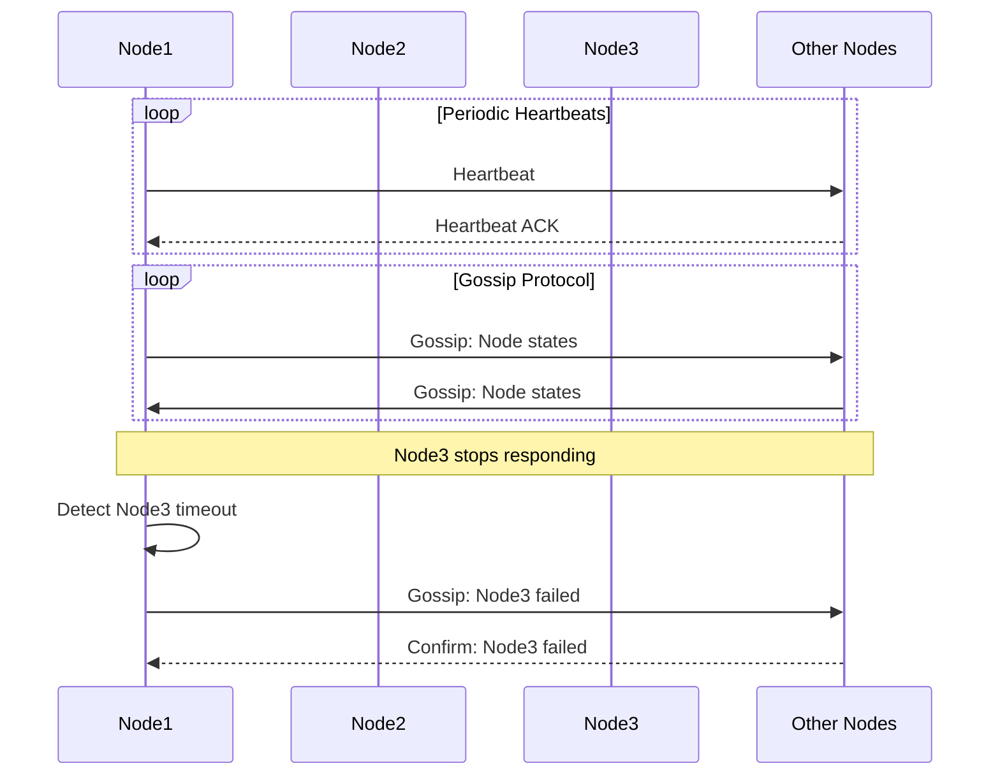

# Distributed Secrets Vault system architecture

1. General architecture

- Client makes requests to the gateway
- Gateway is set up with HAProxy & keepalived
- Gateway sends requests to any node in the cluster (leaderless)

---

2. New user signs up

- TODO: finalize the approach
- Ideas: hash/encrypt user credentials, use a system that doesn't require the user to store credentials (OPAQUE)
- Assume that Oauth2 is set up

---

3. A User puts a secret in the storage

- Client sends the secret with the secret's key to any cluster node
- Receiving node applies Shamir's Secret Sharing in memory, splitting the secret into n shards
- Node distributes n-1 shards to other nodes and keeps 1 shard locally
- k shards are required to reconstruct the secret (threshold scheme)
- **Plaintext secret is never written to durable storage or passed between nodes**
- No master key is required; secrets are protected by distribution

---

4. A user gets a stored secret from the storage

- Client requests the secret using the secret's unique key and version
- The user may request all versions of a secret, which will return a map of version to secret value
- Receiving node requests k shards from other nodes (minimum threshold to reconstruct)
- Node retrieves its own local shard from storage
- Node reconstructs the plaintext secret in memory using Shamir's algorithm (requires k of n shards)
- **Plaintext exists only in memory during reconstruction, never written to disk**
- Node returns the secret value to the client and clears it from memory

---

5. A user updates a stored secret (version control)

- Each time a secret is updated (or stored), the cluster returns the secret version
- Version is determined using a cluster-wide clock system (Lamport?)
- A user can request either a specific version of the secret or the latest
- Update creates a new set of shards for the new version (independent from previous version shards)
- **Each version is independently sharded; old shards remain for version history**

---

6. Cluster node stores its parts in a map

- Each node maps user:key:version to its assigned shard
- No node has enough information to reconstruct a secret alone
- Requires k nodes to collaborate for secret reconstruction
- **No master key is used; security comes from shard distribution**

---

7. Node failure detection

- Use logging with heartbeats and gossip to determine node status

---

8. Node failure recovery

- TODO: finalize the approach
