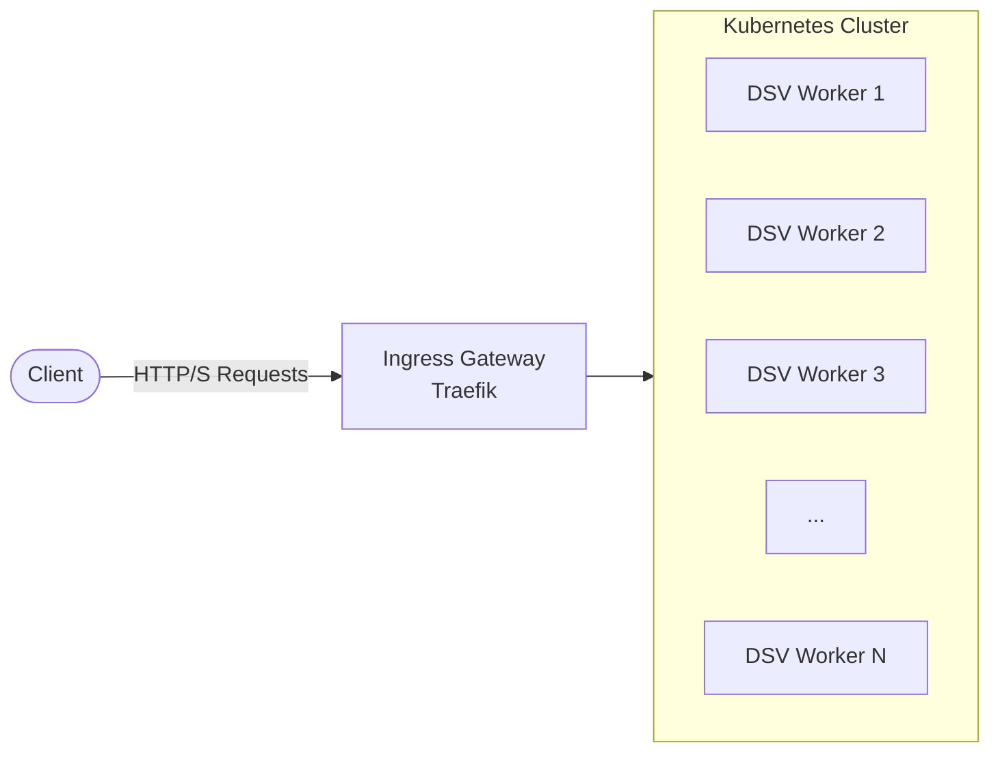
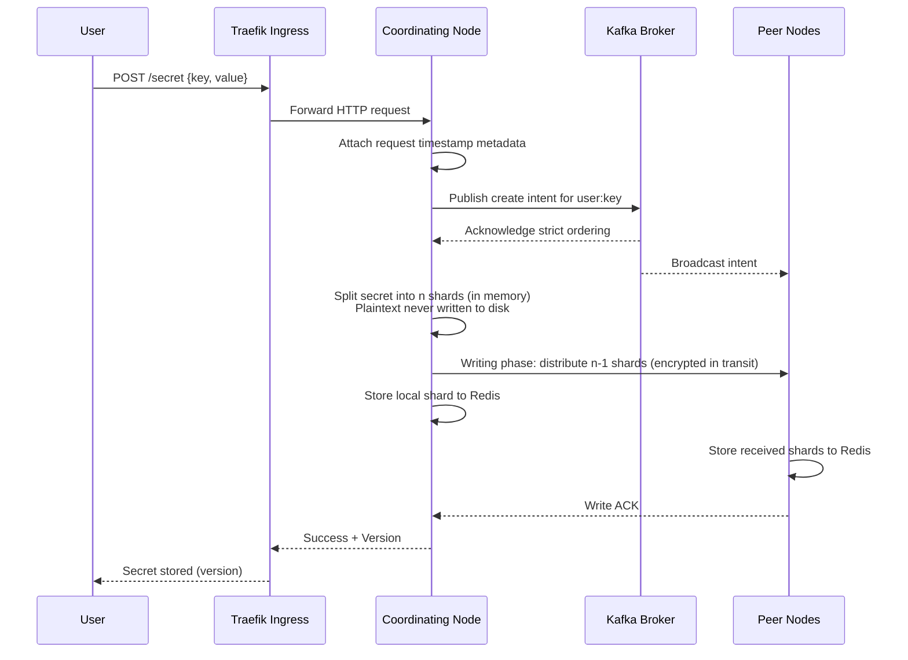
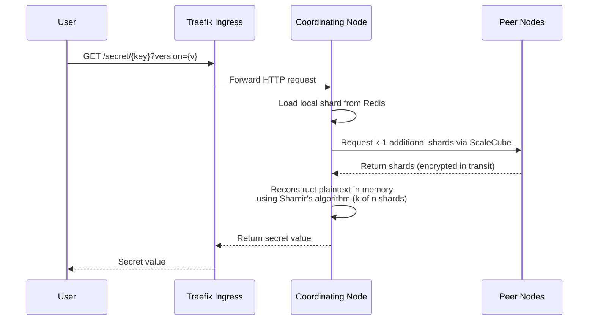
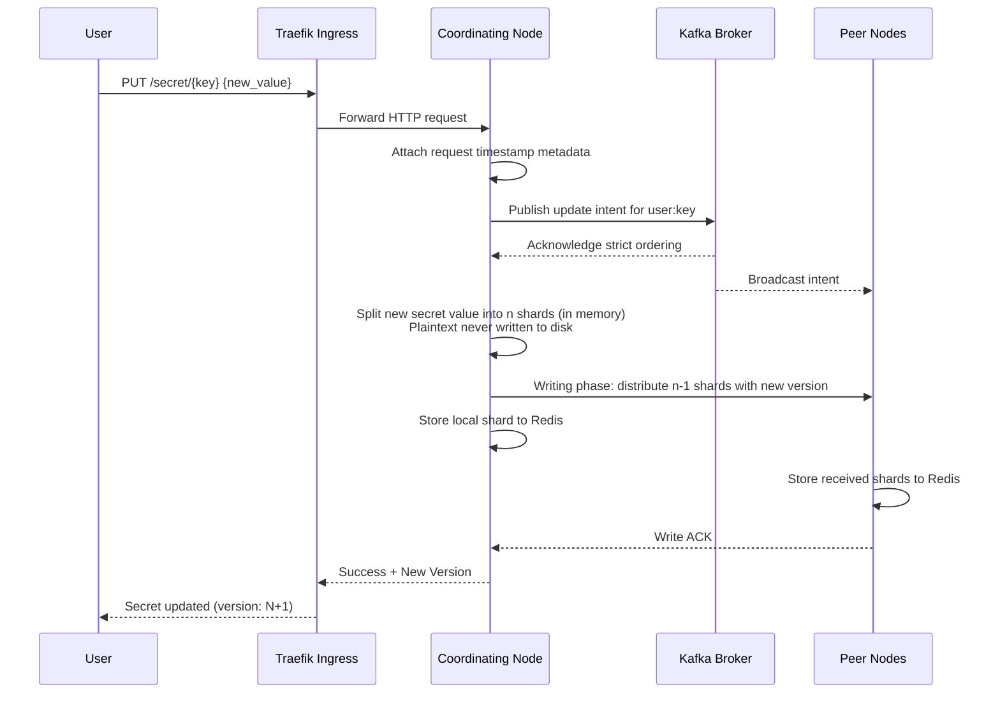
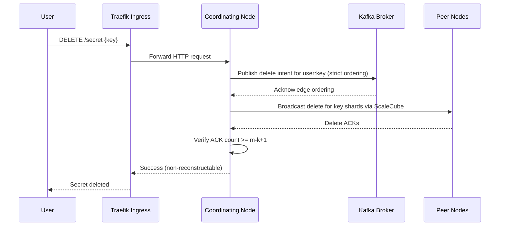
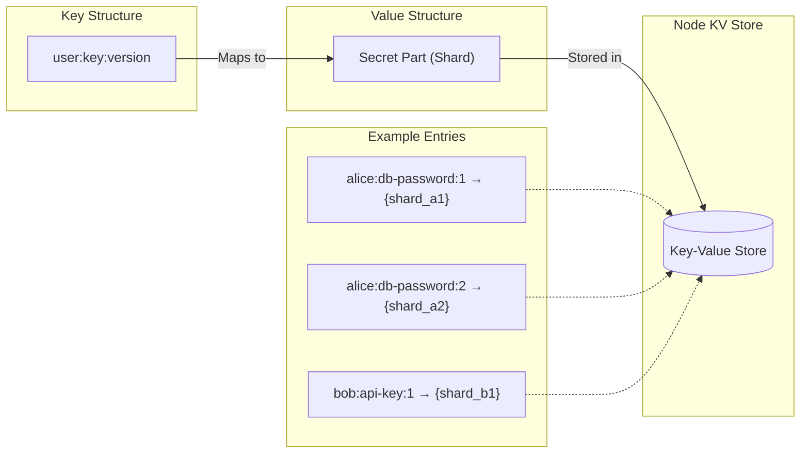

# Distributed Secrets Vault system architecture

1. General architecture

- Client makes requests to the ingress gateway (Traefik)
- Gateway routes requests to any DSV Worker pod in the cluster
- The DSV Worker handles API requests and shard storage (unified design)

---

2. User identity

- User identity and authentication are outside the current DSV backend runtime.
- The vault service stores and retrieves secret shards; it no longer depends on a relational database.

---

3. A User puts a new secret in the storage

- Client sends the secret with the secret's key to the ingress gateway
- A DSV Worker receives the request and acts as the Coordinating Node
- Receiving node attaches request timestamp metadata and starts two-phase commit via Kafka:
  - ordering phase: node publishes a create intent to the strictly ordered Kafka commit log
  - writing phase: node distributes shards via ScaleCube and confirms persistence
- Receiving node applies Shamir's Secret Sharing in memory, splitting the secret into n shards
- Node distributes n-1 shards to other nodes and keeps 1 shard locally
- k shards are required to reconstruct the secret (threshold scheme)
- **Plaintext secret is never written to durable storage or passed between nodes**
- No master key is required; secrets are protected by distribution

---

4. A user gets a stored secret from the storage

- Client requests the secret using the secret's unique key and version
- The user may request all versions of a secret, which will return a map of version to secret value
- Receiving node requests k - 1 shards from nodes, and gets one from itself (minimum threshold to reconstruct)
- Node reconstructs the plaintext secret in memory using Shamir's algorithm (requires k of n shards)
- **Plaintext exists only in memory during reconstruction, never written to disk**
- Node returns the secret value to the client and clears it from memory

---

5. A user updates a stored secret (version control)

- Create and update both use the same two-phase commit flow with Kafka ordering.
- Phase 1 (ordering phase): node publishes update intent to Kafka; concurrent writes are resolved by commit log order.
- Phase 2 (writing phase): shards are distributed and persisted to Redis.
- The DSV Worker attaches request timestamp metadata to incoming write requests.
- Each successful write returns a new secret version
- A user can request either a specific version of the secret or the latest
- Update creates a new set of shards for the new version (independent from previous version shards)
- **Each version is independently sharded; old shards remain for version history**

---

6. A user deletes a stored secret

- Client sends a delete request for a secret key to any cluster node
- Receiving node broadcasts delete to nodes storing shards for that key
- Deletion is considered successful once at least `m-k+1` delete acknowledgments are confirmed
- This guarantees fewer than `k` persisted shards can remain, so reconstruction is no longer possible
- The client receives success only after the threshold is met

---

7. Cluster node stores its parts in a map

- Each node maps user:key:version to its assigned shard
- No node has enough information to reconstruct a secret alone
- Requires k nodes to collaborate for secret reconstruction
- **No master key is used; security comes from shard distribution**

---

8. Node failure detection

- Node status and cluster membership is managed by ScaleCube and Kubernetes.

---

9. Node failure recovery

- If failure occurs in the **ordering phase**, no shard writes are committed and the request fails.
- If failure occurs in the **writing phase**, partially written shards are rolled back.
- Recovered nodes rejoin automatically via ScaleCube and synchronize state from Kafka and peers.
