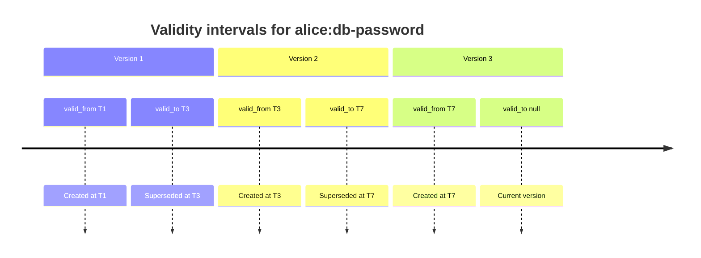
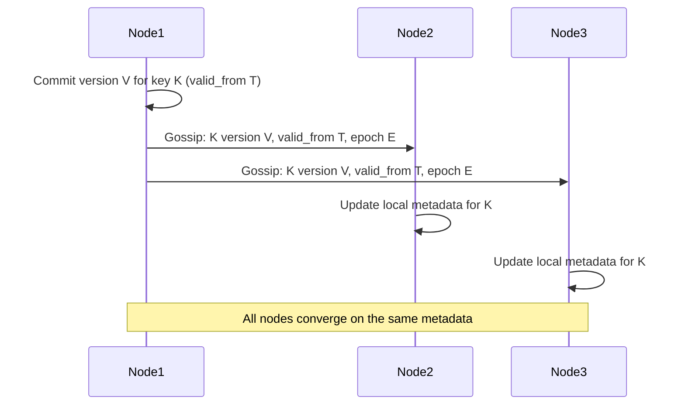
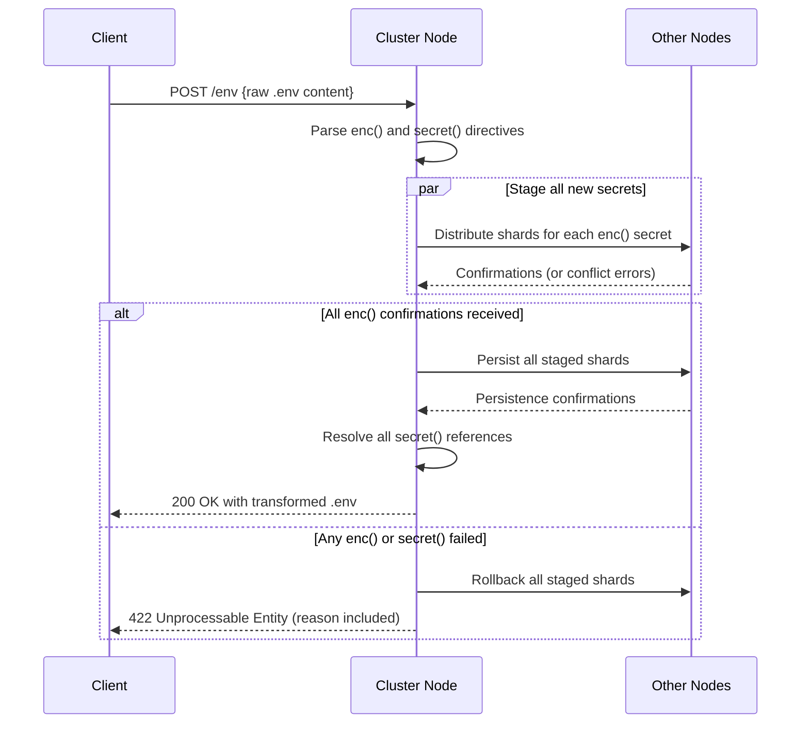
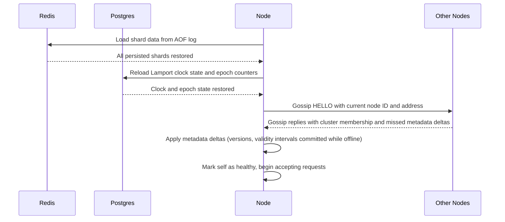
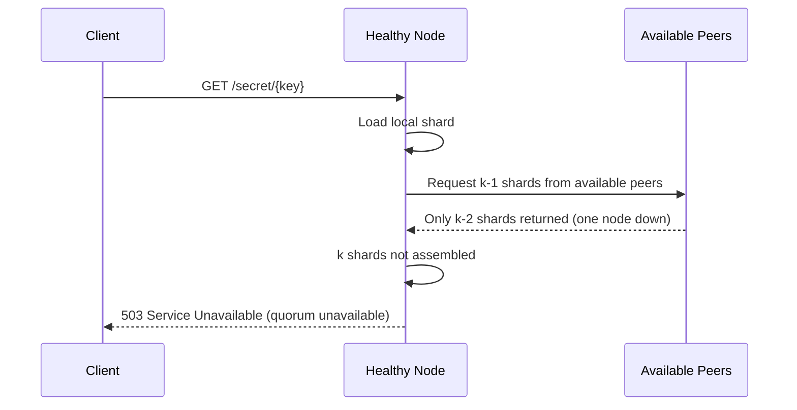

## Distributed Systems Challenges

This document describes how the Distributed Secrets Vault addresses each distributed systems challenge. Where a challenge is fully specified in another document, a reference is provided.

---

## Table of Contents

- [1. Shard Creation and Distribution](#1-shard-creation-and-distribution)
- [2. Quorum-Based Reconstruction](#2-quorum-based-reconstruction)
- [3. Distinguishing Create and Update Operations Under Concurrency](#3-distinguishing-create-and-update-operations-under-concurrency)
- [4. Versioned Updates Using Cluster-Wide Logical Timestamps](#4-versioned-updates-using-cluster-wide-logical-timestamps)
- [5. Tracking and Serving Historical Secret Versions](#5-tracking-and-serving-historical-secret-versions)
- [6. Defining Validity Intervals for Secret Values](#6-defining-validity-intervals-for-secret-values)
- [7. Replication of Authoritative State Across All Nodes](#7-replication-of-authoritative-state-across-all-nodes)
- [8. Correct Handling of Retries and Idempotency](#8-correct-handling-of-retries-and-idempotency)
- [9. Isolation Between Different Callers or Tenants](#9-isolation-between-different-callers-or-tenants)
- [10. Coordinated Creation and Retrieval of Multiple Secrets in a Single Operation](#10-coordinated-creation-and-retrieval-of-multiple-secrets-in-a-single-operation)
- [11. Deterministic Failure When Duplicate or Missing Secrets Are Encountered](#11-deterministic-failure-when-duplicate-or-missing-secrets-are-encountered)
- [12. Deterministic Transformation of `.env` Files](#12-deterministic-transformation-of-env-files)
- [13. Node Failures During Read or Write Operations](#13-node-failures-during-read-or-write-operations)
- [14. Restart and Recovery Without Manual Intervention](#14-restart-and-recovery-without-manual-intervention)
- [15. Quorum Availability](#15-quorum-availability)
- [16. Making Behavior Observable and Explainable](#16-making-behavior-observable-and-explainable)
- [17. Heartbeat and Gossip Protocols](#17-heartbeat-and-gossip-protocols)

---

## 1. Shard Creation and Distribution

**Addressed in:** [architecture.md](architecture.md) (sections 3 and 7), [docs/crud/create.md](crud/create.md)

When a secret is created the receiving node applies Shamir's Secret Sharing in memory to split the secret into n shards. It retains one shard locally and distributes the remaining n-1 shards to peer nodes over encrypted channels. The plaintext secret is never written to durable storage or transmitted between nodes.

---

## 2. Quorum-Based Reconstruction

**Addressed in:** [architecture.md](architecture.md) (section 4), [docs/crud/retrieve.md](crud/retrieve.md)

Secret retrieval requires collecting at least k shards from k distinct nodes. The receiving node loads its own local shard and requests k-1 shards from peers. Reconstruction using Shamir's algorithm happens exclusively in memory, and the plaintext is cleared immediately after it is returned to the caller.

---

## 3. Distinguishing Create and Update Operations Under Concurrency

**Addressed in:** [docs/crud/create.md](crud/create.md) (sections 1 and 2), [docs/crud/update.md](crud/update.md) (sections 1 and 2)

Create and update are separate operations with different pre-conditions. A create request is rejected if the key already exists; an update request is rejected if the key does not exist. Both flows use a two-phase protocol (distribute then persist) guarded by temporary in-memory state and Lamport clock ordering to resolve races between concurrent requests for the same key.

---

## 4. Versioned Updates Using Cluster-Wide Logical Timestamps

**Addressed in:** [architecture.md](architecture.md) (section 5), [docs/crud/update.md](crud/update.md), [docs/crud/retrieve.md](crud/retrieve.md)

Every create and update obtains a monotonically increasing version number and wall-clock timestamp from the cluster-wide Lamport clock before splitting and distributing shards. Shards are keyed by `user:key:version`, so each version is stored independently and all historical versions remain available.

---

## 5. Tracking and Serving Historical Secret Versions

**Addressed in:** [docs/crud/retrieve.md](crud/retrieve.md) (section 3), [docs/scope.md](scope.md)

Each node stores one shard per version of every secret it holds. The retrieve endpoint supports three modes: latest version (version resolved from the Lamport clock), a specific version number, and all versions (returns a map of version → secret value). Each version's plaintext is reconstructed independently and cleared from memory immediately after reconstruction.

---

## 6. Defining Validity Intervals for Secret Values

Every persisted shard record includes two timestamps that together define the interval during which that version was (or is) the authoritative value:

- `valid_from` — the wall-clock timestamp assigned by the Lamport clock when the version was committed. It is set once and never changed.
- `valid_to` — the wall-clock timestamp at which this version was superseded or deleted. It is `null` for the current version and is backfilled when a newer version is committed or the secret is deleted.

### How `valid_to` is set

When a new version V+1 is committed, the cluster sets `valid_to` on all shard records for version V to the `valid_from` of version V+1. When a secret is deleted, `valid_to` on all surviving shard records is set to the deletion timestamp.

Because the Lamport clock provides a total order over all events, `valid_from` values are strictly increasing across versions of the same key, and validity intervals never overlap.



### Storage record fields (per shard)

| Field        | Type      | Description                                                        |
| ------------ | --------- | ------------------------------------------------------------------ |
| `user`       | string    | Authenticated caller identity                                      |
| `key`        | string    | Secret name                                                        |
| `version`    | integer   | Monotonically increasing Lamport version                           |
| `shard`      | bytes     | Encrypted shard bytes (never plaintext)                            |
| `epoch`      | integer   | Delete-cycle counter; incremented on each confirmed delete         |
| `valid_from` | timestamp | When this version became authoritative                             |
| `valid_to`   | timestamp | When this version was superseded or deleted; `null` if current     |

---

## 7. Replication of Authoritative State Across All Nodes

Authoritative state consists of two categories:

1. **Shard data** — each node stores exactly the shards assigned to it. Shard data is replicated during the create/update two-phase protocol: every node that stores a shard for a given `user:key:version` independently persists that shard to its durable Redis store, confirmed via the m-node quorum before success is returned to the caller.

2. **Metadata** — secret existence, version lists, validity intervals, epoch counters, and Lamport clock state do not live on a single node. They are disseminated using the gossip protocol so every node maintains a local, eventually-consistent copy. This lets any node answer existence and version-history queries without contacting a central registry.

### Metadata gossip replication



### Lamport clock persistence

The Lamport clock counter and the current epoch for each key are stored in PostgreSQL. The primary handles all clock writes. Standbys stream from the primary via synchronous WAL replication and are used for read-only fallback if the primary is temporarily unreachable (clock reads only; writes must wait for the primary). On node restart the clock state is reloaded from PostgreSQL and gossip catches up any metadata that arrived while the node was offline.

---

## 8. Correct Handling of Retries and Idempotency

**Addressed in:** [docs/crud/create.md](crud/create.md) (section 9), [docs/crud/update.md](crud/update.md) (section 7)

Each create and update request is idempotent with respect to the final persisted state. If a client retries after a timeout the receiving node detects that the version is already persisted and returns success without re-applying the operation. Duplicate creates are rejected with `409 Conflict`. Duplicate updates at the same Lamport version are treated as idempotent replays and return `200 OK` if the shard data matches the persisted record.

---

## 9. Isolation Between Different Callers or Tenants

**Addressed in:** [docs/scope.md](scope.md), [docs/crud/retrieve.md](crud/retrieve.md) (section 7)

Every secret is scoped to the authenticated caller's identity. The storage key is `user:key:version`, so two users with the same secret name have fully independent secrets. Authorization is enforced at the API layer and re-checked on every node: a node never returns a shard for a key that does not belong to the requesting user. Error responses (`404 Not Found`, `409 Conflict`) do not leak cross-tenant existence information.

---

## 10. Coordinated Creation and Retrieval of Multiple Secrets in a Single Operation

Multi-secret operations are exposed through the `.env` workflow (see [challenge 12](#12-deterministic-transformation-of-env-files) for the full transformation rules). Both creation and retrieval are coordinated as a single all-or-nothing unit:

- **Multi-secret creation** (`enc` directives): all new secrets are staged before any are committed. If any creation fails the entire operation is rolled back and no new secrets are persisted.
- **Multi-secret retrieval** (`secret` directives): all secrets are resolved before the transformed file is returned. If any lookup fails the entire operation fails and no partial result is returned.

The receiving node coordinates both phases using the same two-phase distribution and persistence protocol used for single-secret operations, extended to cover multiple keys in parallel. Each key is assigned a version independently by the Lamport clock, so there are no cross-key ordering guarantees within a single `.env` call — the only guarantee is that all keys are either fully committed or none are.



---

## 11. Deterministic Failure When Duplicate or Missing Secrets Are Encountered

**Addressed in:** [docs/crud/create.md](crud/create.md) (sections 4 and 5), [docs/crud/update.md](crud/update.md), [docs/crud/delete.md](crud/delete.md) (section 2)

The system enforces strict pre-conditions on every operation:

| Operation | Pre-condition        | Failure response |
| --------- | -------------------- | ---------------- |
| Create    | Key must not exist   | `409 Conflict`   |
| Update    | Key must exist       | `404 Not Found`  |
| Retrieve  | Key must exist       | `404 Not Found`  |
| Delete    | Key must exist       | `404 Not Found`  |

These checks are performed both locally (before shard distribution) and cluster-wide (during the receive-phase quorum). Failures are deterministic: the same request under the same cluster state always produces the same error code.

---

## 12. Deterministic Transformation of `.env` Files

The `.env` transformation endpoint accepts a raw `.env` file and processes two directive types:

- `enc(NAME)` — the value is a new secret to be stored. The directive is replaced with `secret(NAME)` in the returned file. Creation fails if a secret named `NAME` already exists.
- `secret(NAME)` — the directive is replaced with the current plaintext value of the named secret inline.

### Transformation rules

1. The file is parsed line by line. Lines without directives are passed through unchanged.
2. All `enc(NAME)` directives are processed first (creation phase). If any secret already exists the entire operation fails before any secret is created.
3. All `secret(NAME)` directives are resolved after creation succeeds. If any secret cannot be found the entire operation fails and any secrets created in step 2 are rolled back.
4. The operation is all-or-nothing: the caller receives either a fully transformed file or an error with no side effects.

### Example

Input:
```
DB_HOST=localhost
DB_PASS=enc(db-password)
API_KEY=secret(api-key)
```

Output (if both operations succeed):
```
DB_HOST=localhost
DB_PASS=secret(db-password)
API_KEY=s3cr3tV@lue
```

### Failure modes

| Failure condition                    | Response                   |
| ------------------------------------ | -------------------------- |
| `enc(NAME)` — secret already exists  | `422 Unprocessable Entity` |
| `secret(NAME)` — secret not found    | `422 Unprocessable Entity` |
| Any node failure during creation     | `503 Service Unavailable`  |
| Any node failure during retrieval    | `503 Service Unavailable`  |

---

## 13. Node Failures During Read or Write Operations

**Addressed in:** [docs/crud/create.md](crud/create.md) (sections 7 and 8), [docs/crud/retrieve.md](crud/retrieve.md) (sections 6 and 9), [docs/crud/update.md](crud/update.md) (sections 5 and 6)

The system tolerates up to n-k node failures on reads (only k shards are needed) and up to n-m node failures on writes (m confirmations required, m ≥ k). HAProxy health checks remove failed nodes from rotation so new requests are not routed to them. Node-to-node shard requests use timeouts; if a peer does not respond within the timeout window the requesting node tries additional peers until k shards are collected or the budget is exhausted.

---

## 14. Restart and Recovery Without Manual Intervention

Each node recovers automatically on restart using durable storage and gossip without requiring operator action.

### Recovery sequence



### Durability guarantees

| Storage layer                        | Persistence mechanism                              | Max data loss on failure   |
| ------------------------------------ | -------------------------------------------------- | -------------------------- |
| Redis (shards)                       | AOF with `everysec` fsync                          | At most 1 second           |
| PostgreSQL (clock, accounts)         | Synchronous WAL on primary + 1 standby             | 0 (synchronous replication)|

### Stale shard handling on restart

If a node was offline when a delete was committed, it may hold shards whose epoch is behind the current cluster epoch. During the gossip delta application step on restart, the node compares the epoch in each incoming metadata delta against the epoch stored with each local shard. Any local shard whose epoch is less than the epoch in the gossip delta is discarded immediately as part of that step, before the node marks itself healthy. This ensures deleted secrets cannot be reconstructed through a restarted node even before it begins accepting requests.

---

## 15. Quorum Availability

The cluster remains operational as long as at least k nodes are healthy. With n total nodes and reconstruction threshold k:

| Operation | Nodes required | Tolerates      |
| --------- | -------------- | -------------- |
| Read      | k              | n − k failures |
| Create    | m (m ≥ k)      | n − m failures |
| Update    | m (m ≥ k)      | n − m failures |
| Delete    | m − k + 1      | n − (m−k+1) failures |

### Degraded mode

When healthy node count drops below k the cluster enters degraded mode:

- Read requests return `503 Service Unavailable` because fewer than k shards can be collected.
- Write requests return `503 Service Unavailable` because the quorum confirmation threshold cannot be met.
- Delete requests may still succeed if m−k+1 or more nodes are healthy and the remaining shards fall below k, making reconstruction impossible.
- Health and status endpoints remain available on all surviving nodes.



### Quorum recovery

When a failed node comes back online (see [challenge 14](#14-restart-and-recovery-without-manual-intervention)) it resumes participating in reads and writes automatically. No operator intervention or cluster reconfiguration is required. HAProxy health checks detect the recovered node and restore it to the routing pool.

---

## 16. Making Behavior Observable and Explainable

Every operation emits structured (JSON) log events and metrics so cluster behavior is fully observable without access to secret values.

### Structured log events

Each log event includes:

| Field         | Description                                      |
| ------------- | ------------------------------------------------ |
| `request_id`  | UUID propagated from gateway through all nodes   |
| `user`        | Authenticated caller identity (hashed if needed) |
| `operation`   | `create`, `update`, `retrieve`, `delete`, `env`  |
| `key`         | Secret name (never the secret value)             |
| `version`     | Lamport version involved                         |
| `node_id`     | The node emitting the event                      |
| `outcome`     | `success`, `conflict`, `not_found`, `error`      |
| `duration_ms` | Wall-clock time for the operation                |

Plaintext secret values are never included in logs.

### Health and status endpoints

| Endpoint      | Description                                                              |
| ------------- | ------------------------------------------------------------------------ |
| `GET /health` | Node liveness; returns `200 OK` when the node is healthy                 |
| `GET /status` | Node status: cluster membership, shard count, clock state, quorum health |

### Metrics

The following metrics are emitted per node and are suitable for aggregation:

- `dsv_operations_total{operation, outcome}` — count of completed operations by type and result
- `dsv_operation_duration_ms{operation}` — histogram of operation latency
- `dsv_quorum_health_events_total` — count of quorum-unavailable events
- `dsv_shard_count` — number of shards held by this node
- `dsv_peer_health{peer_id}` — last known health state of each peer

### Audit log

A separate append-only audit log records every create, update, delete, and retrieve event with the caller identity, key, version, outcome, and timestamp. The audit log supports after-the-fact explanation of any operation without exposing secret values.

---

## 17. Heartbeat and Gossip Protocols

**Addressed in:** [architecture.md](architecture.md) (section 8)

Each node sends periodic heartbeats to all peers. If a peer does not acknowledge a heartbeat within the configured timeout window, the node marks that peer as suspected failed and propagates this state via gossip. Once a majority of nodes agree that a peer has failed, it is removed from the active routing set. Gossip also propagates metadata updates (new versions, validity intervals, epoch changes) so that all nodes converge on the same authoritative state without a central coordinator.
