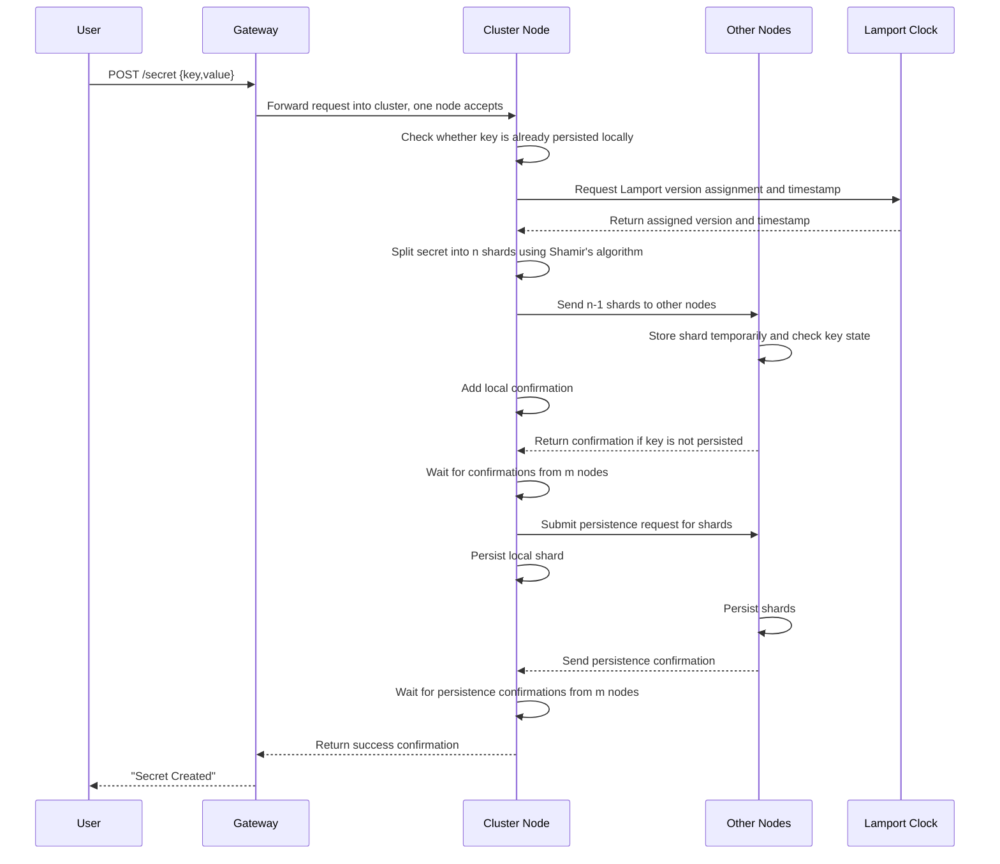
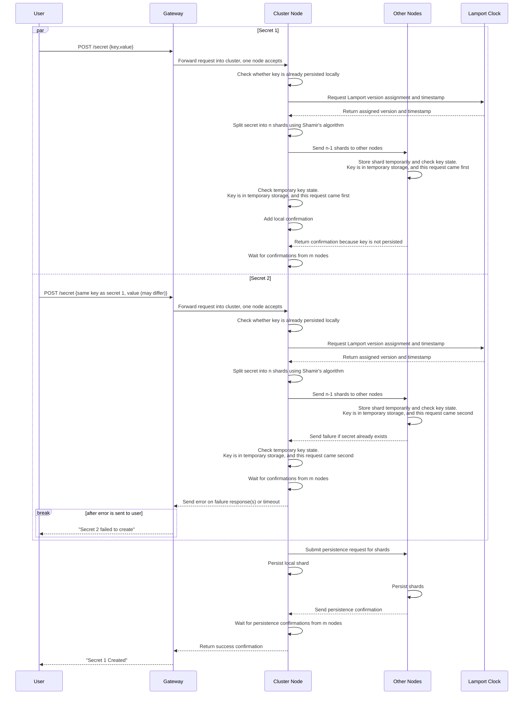

# Create Secret

A client can create a secret only if no secret with the same key already exists. The secret is sent to all n nodes and is not persisted until confirmations are received from m nodes (where m is between k and n).

---

## Table of Contents

**Happy Path**

- [1. Create one secret](#1-create-one-secret)
- [2. Create two secrets](#2-create-two-secrets)

**Error Cases**
- [3. Gateway unable to forward request to node](#3-gateway-unable-to-forward-request-to-node)
- [4. Key is already persisted on the receiving node](#4-key-is-already-persisted-on-the-receiving-node)
- [5. Key is already persisted on another node](#5-key-is-already-persisted-on-another-node)
- [6. Clock does not return version](#6-clock-does-not-return-version)
- [7. M nodes do not send back confirmation for receiving secret](#7-m-nodes-do-not-send-back-confirmation-for-receiving-secret)
- [8. M nodes do not send back confirmation for persisting secret](#8-m-nodes-do-not-send-back-confirmation-for-persisting-secret)
- [9. Client does not receive response](#9-client-does-not-receive-response)
---

## 1. Create one secret

- A client submits a secret through the gateway, and the gateway forwards the request into the cluster where one node picks it up.
- The receiving node validates that the key does not already exist, obtains an assigned Lamport version and timestamp, and splits the secret into n shards.
- The receiving node sends shards to peers, and each node stores its shard in temporary in-memory state so conflicts can be resolved before durable writes.
- The receiving node then submits a persistence request to all nodes and returns success after m persistence confirmations.

---

## 2. Create two secrets

- Two create requests with the same key may be processed concurrently by different nodes.
- Nodes and peers use persisted state, temporary state, and Lamport ordering to resolve the conflict.
- The earlier request continues through quorum and persistence, while the later request is rejected.
- The client receives success for the earlier request and an error for the later one.

---

## 3. Gateway unable to forward request to node

- The gateway attempts to forward a create request to a cluster node.
- If forwarding times out, the gateway retries with another node.
- After repeated timeouts, the gateway returns: "Could not forward request to node".

---

## 4. Key is already persisted on the receiving node

- The receiving node checks local persisted data before starting shard distribution.
- If the key already exists locally, creation is rejected immediately.
- The client receives: "Secret creation failed - key already exists".

---

## 5. Key is already persisted on another node

- The request may pass the initial local check but fail during peer validation.
- If any peer already has the key persisted, it returns a failure and the create operation is aborted.
- The client receives: "Secret creation failed - key already exists", and temporary shards are cleaned up.

---

## 6. Clock does not return version

- The node requests a Lamport version before splitting and distributing shards.
- If the clock does not return a version before timeout, creation cannot continue.
- The client receives: "Secret creation error - clock error".

---

## 7. M nodes do not send back confirmation for receiving secret

- After shard distribution, the node must receive receive-phase confirmations from at least m nodes.
- If quorum is not reached before timeout, the node retries and updates the confirmation count.
- If quorum is still not reached, creation fails with: "Secret creation failed - not enough confirmations from nodes".

---

## 8. M nodes do not send back confirmation for persisting secret

- The operation reaches the persist phase but does not receive persistence confirmations from m nodes.
- The node retries confirmation collection; if the threshold is still unmet, it issues cleanup deletes for partially persisted shards.
- The operation then fails with: "Secret creation failed - not enough confirmations from nodes".

---

## 9. Client does not receive response

- The secret creation flow can complete on the cluster, but the client may not receive the final response.
- After client-side timeout, the client retries the request.
- Retries must be handled safely against already persisted or in-progress state.
