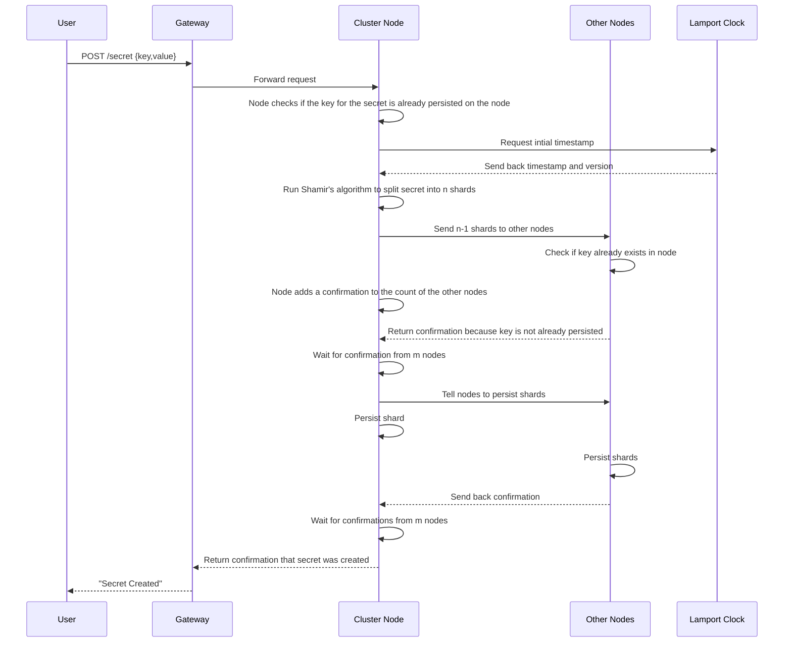
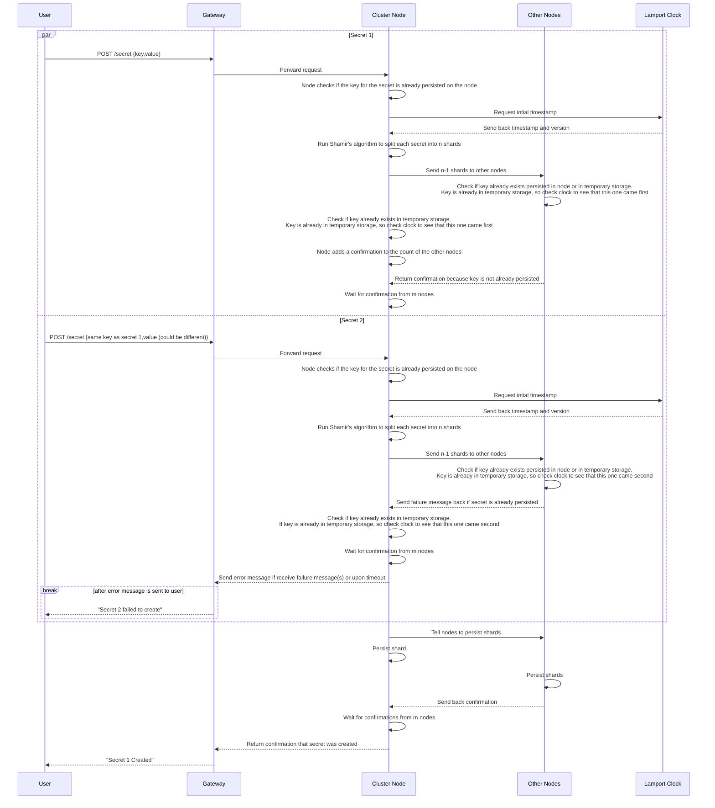

# Create Secret

A client can create a secret only if another secret with the same key doesn't already exist. The secret will be sent to all n nodes, and will not persist until confirmation from m (a number in between k and n) nodes is received.

---

## Table of Contents

**Happy Path**

- [1. Create one secret](#1-create-one-secret)
- [2. Create two secrets](#2-create-two-secrets)

**Error Cases**
- [3. Gateway unable to forward request to node](#3-gateway-unable-to-forward-request-to-node)
- [4. Key is already persisted on the receiving node](#4-key-is-already-persisted-on-the-receiving-node)
- [5. Key is already persisted on another node](#5-key-is-already-persisted-on-another-node)
- [6. Clock does not return version](#6-clock-does-not-return-version)
- [7. M nodes do not send back confirmation for receiving secret](#7-m-nodes-do-not-send-back-confirmation-for-receiving-secret)
- [8. M nodes do not send back confirmation for persisting secret](#8-m-nodes-do-not-send-back-confirmation-for-persisting-secret)
- [9. Client does not receive response](#9-client-does-not-receive-response)
---

## 1. Create one secret

- Client sends a POST request to create a new secret
- Gateway adds timestamp and forwards the request to any cluster node (leaderless routing)
- Node checks if it already persisted any secret with the same key as the requested secret
- Node sends timestamp to Lamport clock and gets version number back
- Node runs Shamir's algorithm to split the secret into n (number of nodes in the cluster) shards
- Node sends shards to other nodes
- Upon receiving a shard, the other nodes check to see if they already contain the same key as the secret that is trying to be created, send back confirmation if key doesn't already exist
- Node keeps a shard for itself, checks if it already contains the key for the secret in temporary storage, and adds itself to the confirmations if it doesn't
- Node waits for confirmation from m (a number in between k and n and more than n-m) nodes (2 Phase Commit)
- Node sends message to nodes to persist any shard for this secret that is being temporarily stored
- Node persists shard that it is temporarily storing
- Other nodes persist shards
- Confirmation sent back to user when confirmation received from m nodes

---

## 2. Create two secrets

- Client sends a POST request to create a new secret
- Client sends another a POST request to create a second secret with the same key
- Gateway adds timestamps to the requests, and forwards each request to any cluster node (leaderless routing) (can be to the same node or different nodes, but it doesn't matter because precedence is determined by Lamport clock)
- Node checks if any secret with the same key as the requested secret is already persisted on the node
- Node gets initial timestamps from Lamport clock
- Node run Shamir's algorithm to split the secrets into n (number of nodes in the cluster) shards
- Node sends shards of each secret to other nodes
- Upon receiving a shard, the other nodes check to see if they already persisted the same key as the secret that is trying to be created, and then check their temporary stored secret shards that have not yet been persisted if any of the keys match the key of this secret
- If it does match a key temporarily stored, checks Lamport clock to find out which one came first
- Continues with the shard that came first, aborts for the shard that came second
- Node also keeps a shard for itself, checks if it already contains the key for the secret persisted, and then checks temporary (non-persisted) secrets to see if any have the same key
- If yes, then check Lamport clock which one was first
- Continues with the shard that came first, aborts for the shard that came second
- Node waits for confirmation from m (a number in between k and n and more than n-m) nodes (2 Phase Commit) for each secret
- Node either receives a failure response or times out waiting for later created secret
- Node sends error message through gateway back to client that the later secret creation failed
- Node sends message to nodes to persist any shard for the earlier created secret that is being temporarily stored
- Node persists shard that it is temporarily storing for earlier created secret
- Other nodes persist shards
- Confirmation sent back for the secret which was created when confirmation received from m nodes

---

## 3. Gateway unable to forward request to node

- Client sends a POST request to create a new secret
- Gateway adds timestamp and forwards the request to any cluster node (leaderless routing)
- Request does not return confirmation code within specificed timeout
- Gateway tries to send request to another node
- If request times out multiple times, return error to client - "Could not forward request to node"
  
---

## 4. Key is already persisted on the receiving node

- Client sends a POST request to create a new secret
- Gateway adds timestamp and forwards the request to any cluster node (leaderless routing)
- Node checks if it already persisted any secret with the same key as the requested secret (receiving node checks first before sending to other nodes as to not do unnecessary computations, as if any node already has the key persisted the creation fails)
- Node finds it has a secret with the same key already persisted, sends error to gateway
- Gateway sends error back to client - "Secret creation failed - key already exists"

---

## 5. Key is already persisted on another node

- Client sends a POST request to create a new secret
- Gateway adds timestamp and forwards the request to any cluster node (leaderless routing)
- Node checks if it already persisted any secret with the same key as the requested secret
- Node sends timestamp to Lamport clock and gets version number back
- Node runs Shamir's algorithm to split the secret into n (number of nodes in the cluster) shards
- Node sends shards to other nodes
- Upon receiving a shard, the other nodes check to see if they already contain the same key as the secret that is trying to be created
- One of the other nodes already has a secret with the same key as the secret trying to be created, and sends failure message to first node
- Node stops waiting for confirmations from other nodes and sends error to gateway
- Gateway sends error back to client - "Secret creation failed - key already exists"
(All received shard in the other nodes' temporary storage will eventually be deleted by Redis)

---

## 6. Clock does not return version

- Client sends a POST request to create a new secret
- Gateway adds timestamp and forwards the request to any cluster node (leaderless routing)
- Node checks if it already persisted any secret with the same key as the requested secret
- Node sends timestamp to Lamport clock and does not get version number back after timeout
- Node sends error back to gateway
- Gateway sends error message to client - "Secret creation error - clock error"

---

## 7. M nodes do not send back confirmation for receiving secret

- Client sends a POST request to create a new secret
- Gateway adds timestamp and forwards the request to any cluster node (leaderless routing)
- Node checks if it already persisted any secret with the same key as the requested secret
- Node sends timestamp to Lamport clock and gets version number back
- Node runs Shamir's algorithm to split the secret into n (number of nodes in the cluster) shards
- Node sends shards to other nodes
- Upon receiving a shard, the other nodes check to see if they already contain the same key as the secret that is trying to be created, send back confirmation if key doesn't already exist
- Node keeps a shard for itself, checks if it already contains the key for the secret in temporary storage, and adds itself to the confirmations if it doesn't
- Node waits for confirmation from m (a number in between k and n and more than n-m) nodes (2 Phase Commit)
- Node does not receive confirmation from m nodes after timeout
- Node tries again, ignoring failure messages from nodes for existing key and adding any new confirmations to the count
- If still doesn't reach confirmation threshold, node sends error to gateway
- Gateway sends error back to client - "Secret creation failed - not enough confirmations from nodes"
---

## 8. M nodes do not send back confirmation for persisting secret

- Client sends a POST request to create a new secret
- Gateway adds timestamp and forwards the request to any cluster node (leaderless routing)
- Node checks if it already persisted any secret with the same key as the requested secret
- Node sends timestamp to Lamport clock and gets version number back
- Node runs Shamir's algorithm to split the secret into n (number of nodes in the cluster) shards
- Node sends shards to other nodes
- Upon receiving a shard, the other nodes check to see if they already contain the same key as the secret that is trying to be created, send back confirmation if key doesn't already exist
- Node keeps a shard for itself, checks if it already contains the key for the secret in temporary storage, and adds itself to the confirmations if it doesn't
- Node waits for confirmation from m (a number in between k and n and more than n-m) nodes (2 Phase Commit)
- Node sends message to nodes to persist any shard for this secret that is being temporarily stored
- Node persists shard that it is temporarily storing
- Other nodes persist shards
- Node does not receive confirmation from m nodes after timeout
- Node tries again, ignoring failure messages from nodes for existing key and adding any new confirmations to the count
- If still doesn't reach m-n confirmations, node sends delete request to the other nodes to delete this secret they may have persisted because not enough nodes sent back confirmation of persisting their shards
- Nodes delete persisted shars of the secret and send back confirmation the secret doesn't exist on the node
- Node sends error to gateway
- Gateway sends error back to client - "Secret creation failed - not enough confirmations from nodes"

---

## 9. Client does not receive response

- Client sends a POST request to create a new secret
- Gateway adds timestamp and forwards the request to any cluster node (leaderless routing)
- Node checks if it already persisted any secret with the same key as the requested secret
- Node sends timestamp to Lamport clock and gets version number back
- Node runs Shamir's algorithm to split the secret into n (number of nodes in the cluster) shards
- Node sends shards to other nodes
- Upon receiving a shard, the other nodes check to see if they already contain the same key as the secret that is trying to be created, send back confirmation if key doesn't already exist
- Node keeps a shard for itself, checks if it already contains the key for the secret in temporary storage, and adds itself to the confirmations if it doesn't
- Node waits for confirmation from m (a number in between k and n and more than n-m) nodes (2 Phase Commit)
- Node sends message to nodes to persist any shard for this secret that is being temporarily stored
- Node persists shard that it is temporarily storing
- Other nodes persist shards
- No response sent to client, and client retries after timeout
