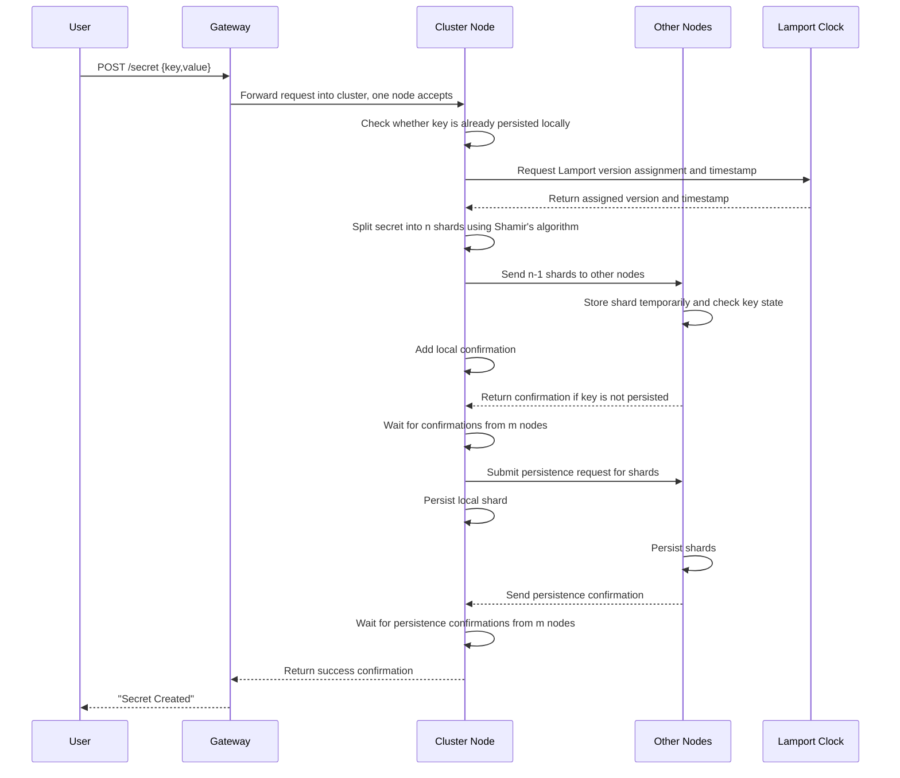
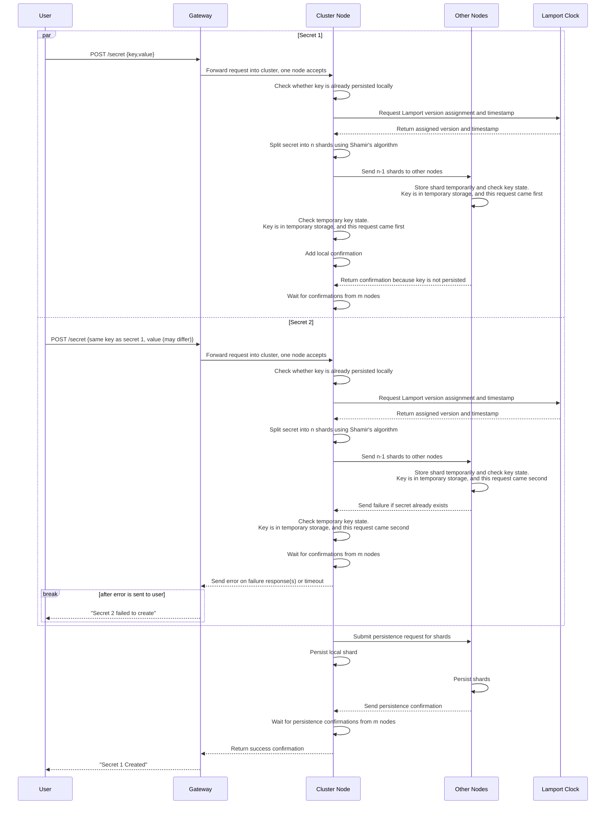

# Create Secret

A client can create a secret only if no secret with the same key already exists. The secret is sent to all n nodes and is not persisted until confirmations are received from m nodes (where m is between k and n).

---

## Table of Contents

**Happy Path**

- [1. Create one secret](#1-create-one-secret)
- [2. Create two secrets](#2-create-two-secrets)

**Error Cases**

- [3. Gateway unable to forward request to node](#3-gateway-unable-to-forward-request-to-node)
- [4. Key is already persisted on the receiving node](#4-key-is-already-persisted-on-the-receiving-node)
- [5. Key is already persisted on another node](#5-key-is-already-persisted-on-another-node)
- [6. Clock does not return version](#6-clock-does-not-return-version)
- [7. M nodes do not send back confirmation for receiving secret](#7-m-nodes-do-not-send-back-confirmation-for-receiving-secret)
- [8. M nodes do not send back confirmation for persisting secret](#8-m-nodes-do-not-send-back-confirmation-for-persisting-secret)
- [9. Client does not receive response](#9-client-does-not-receive-response)
- [10. Stale shards exist from a previously deleted secret](#10-stale-shards-exist-from-a-previously-deleted-secret)

---

## 1. Create one secret

- A client submits a secret through the gateway, and the gateway forwards the request into the cluster where one node picks it up.
- The receiving node validates that the key does not already exist, obtains an assigned Lamport version and timestamp, and splits the secret into n shards.
- The receiving node sends shards to peers, and each node stores its shard in temporary in-memory state so conflicts can be resolved before durable writes.
- The receiving node then submits a persistence request to all nodes and returns success after m persistence confirmations.
- **Response**: `201 Created`



---

## 2. Create two secrets

- Two create requests with the same key may be processed concurrently by different nodes.
- Nodes and peers use persisted state, temporary state, and Lamport ordering to resolve the conflict.
- The earlier request continues through quorum and persistence, while the later request is rejected.
- The client receives success for the earlier request and an error for the later one.
- **Response**: `201 Created` for the earlier request; `409 Conflict` for the later request



---

## 3. Gateway unable to forward request to node

- The gateway attempts to forward a create request to a cluster node.
- If forwarding times out, the gateway retries with another node.
- After repeated timeouts, the gateway returns: "Could not forward request to node".
- **Response**: `503 Service Unavailable`

---

## 4. Key is already persisted on the receiving node

- The receiving node checks local persisted data before starting shard distribution.
- If the key already exists locally, creation is rejected immediately.
- The client receives: "Secret creation failed - key already exists".
- **Response**: `409 Conflict`

---

## 5. Key is already persisted on another node

- The request may pass the initial local check but fail during peer validation.
- If any peer already has the key persisted, it returns a failure and the create operation is aborted.
- The client receives: "Secret creation failed - key already exists", and temporary shards are cleaned up.
- **Response**: `409 Conflict`

---

## 6. Clock does not return version

- The node requests a Lamport version before splitting and distributing shards.
- If the clock does not return a version before timeout, creation cannot continue.
- The client receives: "Secret creation error - clock error".
- **Response**: `503 Service Unavailable`

---

## 7. M nodes do not send back confirmation for receiving secret

- After shard distribution, the node must receive receive-phase confirmations from at least m nodes.
- If quorum is not reached before timeout, the node retries and updates the confirmation count.
- If quorum is still not reached, creation fails with: "Secret creation failed - not enough confirmations from nodes".
- **Response**: `503 Service Unavailable`

---

## 8. M nodes do not send back confirmation for persisting secret

- The operation reaches the persist phase but does not receive persistence confirmations from m nodes.
- The node retries confirmation collection; if the threshold is still unmet, it issues cleanup deletes for partially persisted shards.
- The operation then fails with: "Secret creation failed - not enough confirmations from nodes".
- **Response**: `503 Service Unavailable`

---

## 9. Client does not receive response

- The secret creation flow can complete on the cluster, but the client may not receive the final response.
- After client-side timeout, the client retries the request.
- Retries must be handled safely against already persisted or in-progress state.
- **Response**: `201 Created` (sent by server; not received by client due to timeout)

---

## 10. Stale shards exist from a previously deleted secret

- A secret was previously created and later deleted, but the delete did not reach every node (only the minimum `m − k + 1` delete confirmations were required, ensuring fewer than `k` shards remain and the secret is non-reconstructable, but up to `k − 1` nodes may still hold old shards).
- A new create request arrives for the same key. Nodes that still hold old shards would incorrectly treat the key as already existing and reject the create.
- To resolve this, every shard is stored together with an **epoch number** for its key. The epoch starts at `1` when a key is first created and is incremented by `1` each time a delete of that key is confirmed by the cluster.
- The epoch for each key is tracked in the cluster-wide version metadata (the same Lamport-clock-backed store used for version numbers). When a delete reaches the `m − k + 1` confirmation threshold, the cluster atomically records that the key's epoch has advanced. Any subsequent create or version-resolution query for that key returns the new epoch value.
- When a create request arrives, the receiving node queries the cluster-wide clock for the latest epoch associated with the key and includes this epoch in the shard distribution message sent to peers.
- When a peer receives a shard, it compares the epoch in the request against the epoch of any locally persisted shard for the same key:
  - If the local shard's epoch is **lower** than the request epoch, the local shard is from a deleted version of the secret. The peer discards (or marks for cleanup) the stale shard and accepts the new one.
  - If the local shard's epoch is **equal** to the request epoch, the key already exists in the current epoch and the create is rejected as a duplicate (`409 Conflict`).
- This ensures that lingering stale shards from a previous delete cycle never block a legitimate re-creation of the same key.
- **Response**: `201 Created` (stale shards cleaned up and new secret persisted successfully)

```mermaid
sequenceDiagram
    participant User
    participant Gateway
    participant Node as Cluster Node
    participant Peers as Other Nodes
    participant Clock as Lamport Clock

    User->>Gateway: POST /secret {key,value}
    Gateway->>Node: Forward request into cluster, one node accepts
    Node->>Node: Check whether key is already persisted locally.<br/>Finds stale shard with epoch E-1
    Node->>Clock: Request Lamport version assignment, timestamp, and current epoch for key
    Clock-->>Node: Return assigned version, timestamp, and epoch E
    Note over Node: Epoch E > stale shard epoch E-1,<br/>so local stale shard is discarded
    Node->>Node: Split secret into n shards using Shamir's algorithm
    Node->>Peers: Send n-1 shards with epoch E to other nodes
    Peers->>Peers: Compare request epoch E against local shard epoch.<br/>Stale shard (epoch E-1) discarded; shard stored temporarily
    Node->>Node: Add local confirmation
    Peers-->>Node: Return confirmation (stale epoch detected and resolved)
    Node->>Node: Wait for confirmations from m nodes
    Node->>Peers: Submit persistence request for shards (epoch E)
    Node->>Node: Persist local shard with epoch E
    Peers->>Peers: Persist shards with epoch E
    Peers-->>Node: Send persistence confirmation
    Node->>Node: Wait for persistence confirmations from m nodes
    Node-->>Gateway: Return success confirmation
    Gateway-->>User: "Secret Created"
```
