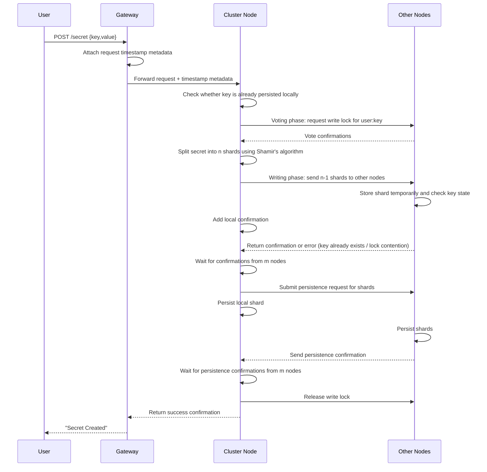
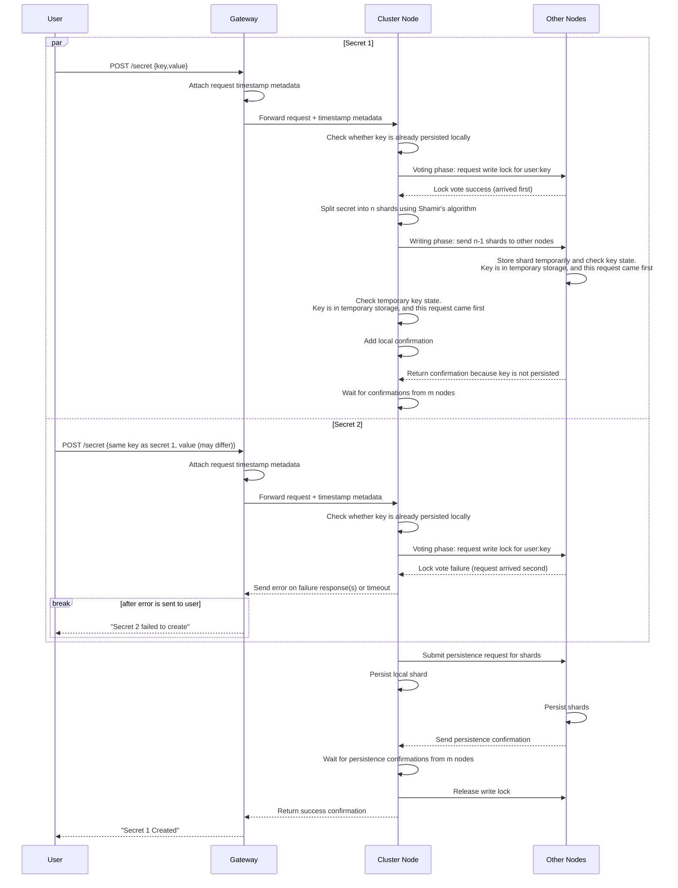

# Create Secret

A client can create a secret only if no secret with the same key already exists. The secret is sent to all n nodes and is not persisted until confirmations are received from m nodes (where m is between k and n).

---

## Table of Contents

**Happy Path**

- [1. Create one secret](#1-create-one-secret)
- [2. Create two secrets](#2-create-two-secrets)

**Error Cases**

- [3. Gateway unable to forward request to node](#3-gateway-unable-to-forward-request-to-node)
- [4. Key is already persisted on the receiving node](#4-key-is-already-persisted-on-the-receiving-node)
- [5. Key is already persisted on another node](#5-key-is-already-persisted-on-another-node)
- [6. Gateway metadata missing or invalid](#6-gateway-metadata-missing-or-invalid)
- [7. M nodes do not send back confirmation for receiving secret](#7-m-nodes-do-not-send-back-confirmation-for-receiving-secret)
- [8. M nodes do not send back confirmation for persisting secret](#8-m-nodes-do-not-send-back-confirmation-for-persisting-secret)
- [9. Client does not receive response](#9-client-does-not-receive-response)
- [10. Stale shards exist from a previously deleted secret](#10-stale-shards-exist-from-a-previously-deleted-secret)

---

## 1. Create one secret

- A client submits a secret through the gateway, and the gateway forwards the request into the cluster where one node picks it up.
- The receiving node validates that the key does not already exist, then starts two-phase commit for `user:key`.
- In the **voting phase**, nodes vote on write-lock ownership for the key and block competing writes until lock release.
- In the **writing phase**, the lock owner splits the secret into n shards, sends shards to peers, and each node stages its shard in temporary in-memory state.
- The receiving node then submits a persistence request to all nodes and returns success after m persistence confirmations.
- **Response**: `201 Created`

---

## 2. Create two secrets

- Two create requests with the same key may be processed concurrently by different nodes.
- Nodes and peers use persisted state, temporary state, and voting-phase lock ownership to resolve the conflict.
- The earlier request continues through quorum and persistence, while the later request is rejected.
- The client receives success for the earlier request and an error for the later one.
- **Response**: `201 Created` for the earlier request; `409 Conflict` for the later request

---

## 3. Gateway unable to forward request to node

- The gateway attempts to forward a create request to a cluster node.
- If forwarding times out, the gateway retries with another node.
- After repeated timeouts, the gateway returns: "Could not forward request to node".
- **Response**: `503 Service Unavailable`

---

## 4. Key is already persisted on the receiving node

- The receiving node checks local persisted data before starting shard distribution.
- If the key already exists locally, creation is rejected immediately.
- The client receives: "Secret creation failed - key already exists".
- **Response**: `409 Conflict`

---

## 5. Key is already persisted on another node

- The request may pass the initial local check but fail during peer validation.
- If any peer already has the key persisted, it returns a failure and the create operation is aborted.
- The client receives: "Secret creation failed - key already exists", and temporary shards are cleaned up.
- **Response**: `409 Conflict`

---

## 6. Gateway metadata missing or invalid

- The node requires gateway-attached timestamp metadata before starting write coordination.
- If metadata is missing or invalid, creation cannot continue.
- The client receives: "Secret creation error - invalid request metadata".
- **Response**: `503 Service Unavailable`

---

## 7. M nodes do not send back confirmation for receiving secret

- After shard distribution, the node must receive receive-phase confirmations from at least m nodes.
- If quorum is not reached before timeout, the node retries and updates the confirmation count.
- If quorum is still not reached, creation fails with: "Secret creation failed - not enough confirmations from nodes".
- **Response**: `503 Service Unavailable`

---

## 8. M nodes do not send back confirmation for persisting secret

- The operation reaches the persist phase but does not receive persistence confirmations from m nodes.
- The node retries confirmation collection; if the threshold is still unmet, it issues cleanup deletes for partially persisted shards.
- The operation then fails with: "Secret creation failed - not enough confirmations from nodes".
- **Response**: `503 Service Unavailable`

---

## 9. Client does not receive response

- The secret creation flow can complete on the cluster, but the client may not receive the final response.
- After client-side timeout, the client retries the request.
- Retries must be handled safely against already persisted or in-progress state.
- **Response**: `201 Created` (sent by server; not received by client due to timeout)

---

## 10. Stale shards exist from a previously deleted secret

- A secret was previously deleted, but up to `k − 1` nodes may still hold old shards because only `m − k + 1` delete confirmations were required.
- Each shard is stored with an epoch number for its key; the epoch is tracked in replicated key metadata and is incremented each time a delete is confirmed.
- When a create request arrives for the same key, the receiving node uses the latest replicated epoch and includes it in shard distribution messages to peers.
- Peers compare the request epoch against the epoch of any locally stored shard: a lower local epoch means the shard is stale and is discarded; an equal epoch means the key already exists and the create is rejected.
- **Response**: `201 Created` (stale shards discarded and new secret persisted successfully)
