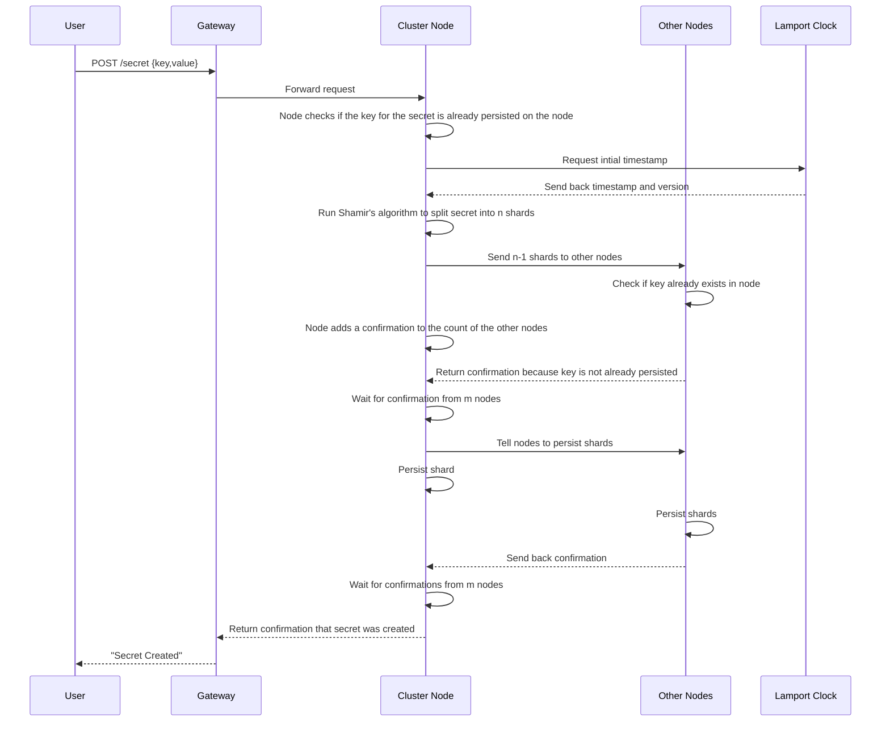
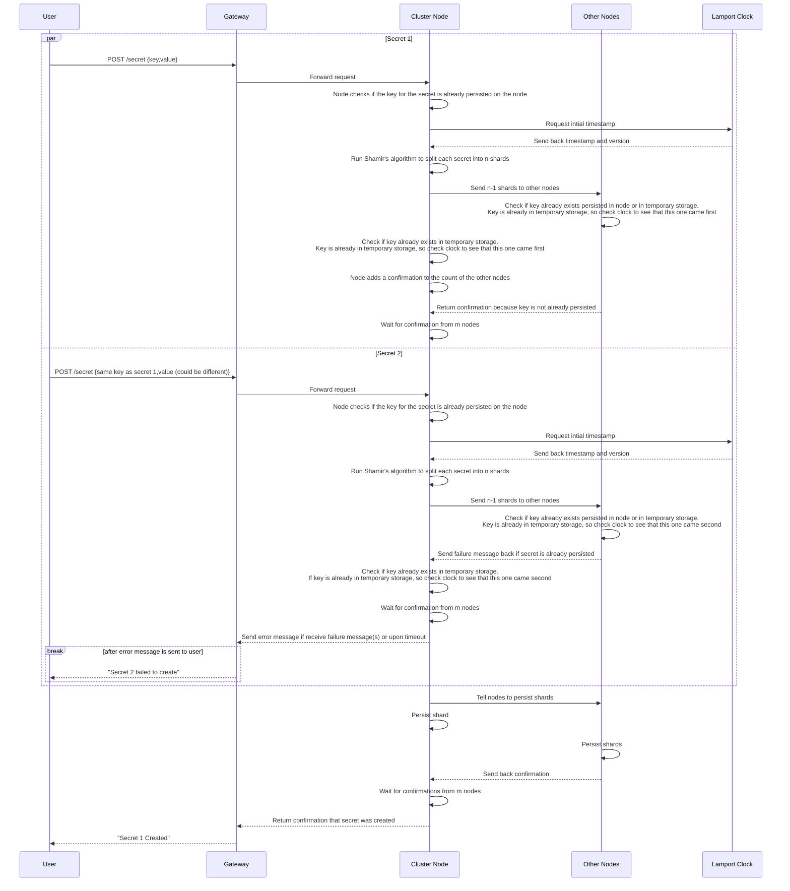

# Create Secret

A client can create a secret only if another secret with the same key doesn't already exist. The secret will be sent to all n nodes, and will not persist until confirmation from m (a number in between k and n) nodes is received.

---

## Table of Contents

**Happy Path**

- [1. Create one secret](#1-create-one-secret)
- [2. Create two secrets](#2-create-two-secrets)

**Error Cases**

---

## 1. Create one secret

- Client sends a POST request to create a new secret
- Gateway adds timestamp and forwards the request to any cluster node (leaderless routing)
- Node checks if it already persisted any secret with the same key as the requested secret
- Node sends timestamp to Lamport clock and gets version number back
- Node runs Shamir's algorithm to split the secret into n (number of nodes in the cluster) shards
- Node sends shards to other nodes
- Upon receiving a shard, the other nodes check to see if they already contain the same key as the secret that is trying to be created, send back confirmation if key doesn't already exist
- Node keeps a shard for itself, checks if it already contains the key for the secret in temporary storage, and adds itself to the confirmations if it doesn't
- Node waits for confirmation from m (a number in between k and n and more than n-m) nodes (2 Phase Commit)
- Node sends message to nodes to persist any shard for this secret that is being temporarily stored
- Node persists shard that it is temporarily storing
- Other nodes persist shards
- Confirmation sent back to user when confirmation received from m nodes

---

## 2. Create two secrets

- Client sends a POST request to create a new secret
- Client sends another a POST request to create a second secret with the same key
- Gateway adds timestamps to the requests, and forwards each request to any cluster node (leaderless routing) (can be to the same node or different nodes, but it doesn't matter because precedence is determined by Lamport clock)
- Node checks if any secret with the same key as the requested secret is already persisted on the node
- Node gets initial timestamps from Lamport clock
- Node run Shamir's algorithm to split the secrets into n (number of nodes in the cluster) shards
- Node sends shards of each secret to other nodes
- Upon receiving a shard, the other nodes check to see if they already persisted the same key as the secret that is trying to be created, and then check their temporary stored secret shards that have not yet been persisted if any of the keys match the key of this secret
- If it does match a key temporarily stored, checks Lamport clock to find out which one came first
- Continues with the shard that came first, aborts for the shard that came second
- Node also keeps a shard for itself, checks if it already contains the key for the secret persisted, and then checks temporary (non-persisted) secrets to see if any have the same key
- If yes, then check Lamport clock which one was first
- Continues with the shard that came first, aborts for the shard that came second
- Node waits for confirmation from m (a number in between k and n and more than n-m) nodes (2 Phase Commit) for each secret
- Node either receives a failure response or times out waiting for later created secret
- Node sends error message through gateway back to client that the later secret creation failed
- Node sends message to nodes to persist any shard for the earlier created secret that is being temporarily stored
- Node persists shard that it is temporarily storing for earlier created secret
- Other nodes persist shards
- Confirmation sent back for the secret which was created when confirmation received from m nodes

---

