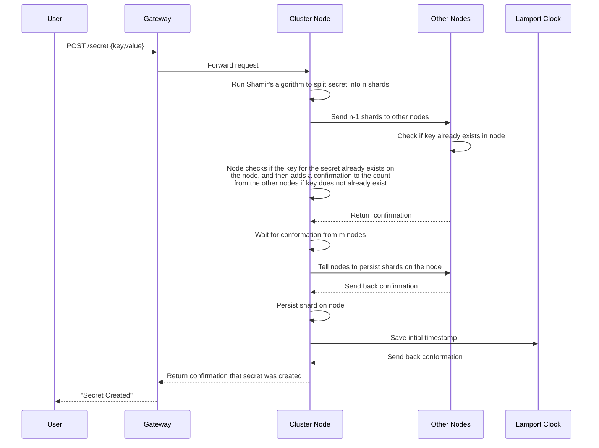
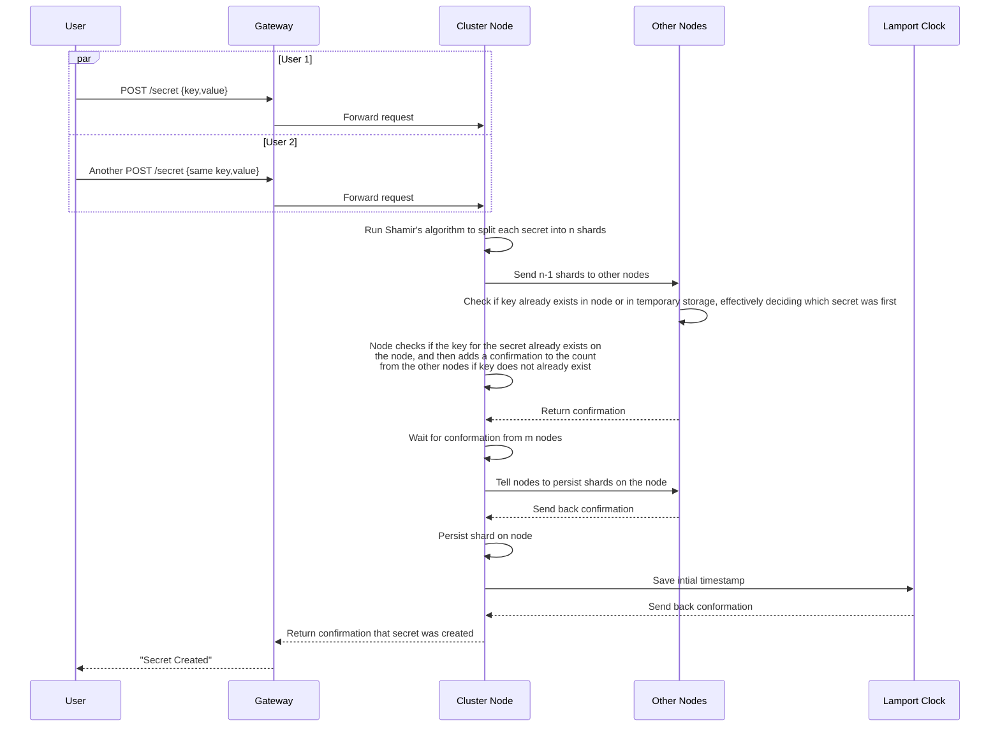

# Create Secret

A client can create a secret only if another secret with the same key doesn't already exist. The secret will be sent to all n nodes, and will not persist until confirmation from m (a number in between k and n) nodes is received.

---

## Table of Contents

**Happy Path**

- [1. Create one secret](#1-create-one-secret)
- [2. Create two secrets](#2-create-two-secrets)

**Error Cases**

---

## 1. Create one secret

- Client sends a POST request to create a new secret
- Gateway forwards the request to any cluster node (leaderless routing)
- Node runs Shamir's algorithm to split the secret into n (number of nodes in the cluster) nodes
- Node sends shards to other nodes, as well 
- Upon receiving a shard, the other nodes check to see if they already contain the same key as the secret that is trying to be created, send back confirmation if key doesn't already exist
- Node keeps a shard for itself, checks if it already contains the key for the secret, and adds itself to the confirmations if it doesn't
- Node waits for confirmation from m (a number in between k and n and more than n-m) nodes (2 Phase Commit)
- Node sends message to nodes to persist any shard for this secret that is being temporarily stored
- Node persists shard that it is temporarily storing
- Node saves initial timestamp in Lamport clock now that secret is created
- Confirmation sent back to user

---

## 2. Create two secrets

- Client sends a POST request to create a new secret
- Another client sends a POST request to create a secret with the same key
- Gateway forwards the request to any cluster node (leaderless routing)
- Node runs Shamir's algorithm to split the secret into n (number of nodes in the cluster) nodes
- Node sends shards to other nodes, as well 
- Upon receiving a shard, the other nodes check to see if they already contain the same key as the secret that is trying to be created, send back confirmation if key doesn't already exist
- Node keeps a shard for itself, checks if it already contains the key for the secret, and adds itself to the confirmations if it doesn't
- Node waits for confirmation from m (a number in between k and n and more than n-m) nodes (2 Phase Commit)
- Node sends message to nodes to persist any shard for this secret that is being temporarily stored
- Node persists shard that it is temporarily storing
- Node saves initial timestamp in Lamport clock now that secret is created
- Confirmation sent back to user

---
