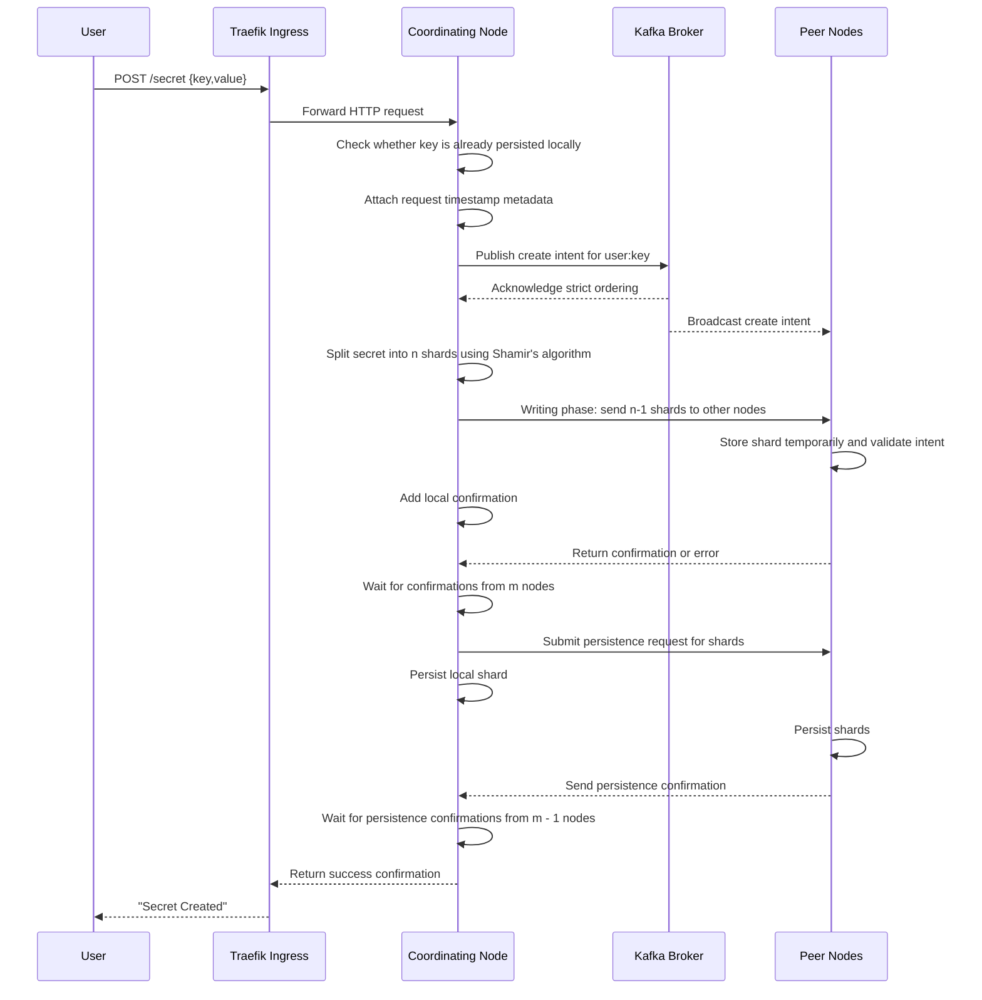
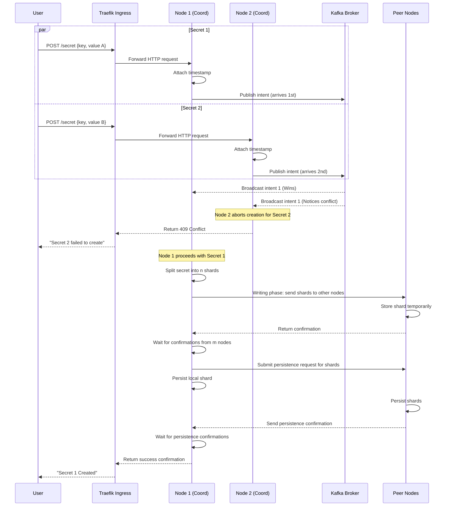

# Create Secret

A client can create a secret only if no secret with the same key already exists. The secret is sent to all n nodes and is not persisted until confirmations are received from m nodes (where m is between k and n).

---

## Table of Contents

**Happy Path**

- [1. Create one secret](#1-create-one-secret)
- [2. Create two secrets](#2-create-two-secrets)

**Error Cases**

- [3. Ingress unable to forward request to node](#3-ingress-unable-to-forward-request-to-node)
- [4. Key is already persisted on the receiving node](#4-key-is-already-persisted-on-the-receiving-node)
- [5. Key is already persisted on another node](#5-key-is-already-persisted-on-another-node)
- [6. Coordinating Node metadata missing or invalid](#6-coordinating-node-metadata-missing-or-invalid)
- [7. M nodes do not send back confirmation for receiving secret](#7-m-nodes-do-not-send-back-confirmation-for-receiving-secret)
- [8. M nodes do not send back confirmation for persisting secret](#8-m-nodes-do-not-send-back-confirmation-for-persisting-secret)
- [9. Client does not receive response](#9-client-does-not-receive-response)
- [10. Stale shards exist from a previously deleted secret](#10-stale-shards-exist-from-a-previously-deleted-secret)

---

## 1. Create one secret

- A client submits a secret through the ingress gateway (Traefik), which routes it to a DSV Worker (acting as the Coordinating Node).
- The Coordinating Node validates that the key does not already exist locally, attaches timestamp metadata, and starts the two-phase commit process via Kafka.
- In the **ordering phase**, the node publishes a create intent to the Kafka commit log. All nodes consume this log to establish a globally agreed-upon order, resolving concurrent write races.
- In the **writing phase**, the Coordinating Node splits the secret into n shards using Shamir's algorithm, sends shards to peer nodes (via ScaleCube), and each node stages its shard in temporary in-memory state.
- The Coordinating Node then submits a persistence request to all nodes and returns success after m persistence confirmations.
- **Response**: `201 Created`

---

## 2. Create two secrets

- Two create requests with the same key may be processed concurrently by different nodes.
- Instead of peer-to-peer voting, the nodes publish their create intents to Kafka.
- Kafka strictly orders the requests. The request that appears first in the commit log continues through quorum and persistence.
- The node handling the later request observes the conflict from the commit log and aborts.
- The client receives success for the earlier request and an error for the later one.
- **Response**: `201 Created` for the earlier request; `409 Conflict` for the later request

---

## 3. Ingress unable to forward request to node

- The Traefik ingress attempts to forward a create request to a cluster node.
- If forwarding times out, the ingress retries with another node based on its load balancing configuration.
- After repeated timeouts, the ingress returns a failure.
- **Response**: `503 Service Unavailable`

---

## 4. Key is already persisted on the receiving node

- The receiving node checks local persisted data before starting shard distribution.
- If the key already exists locally, creation is rejected immediately.
- The client receives: "Secret creation failed - key already exists".
- **Response**: `409 Conflict`

---

## 5. Key is already persisted on another node

- The request may pass the initial local check but fail during peer validation.
- If any peer already has the key persisted, it returns a failure and the create operation is aborted.
- The client receives: "Secret creation failed - key already exists", and temporary shards are cleaned up.
- **Response**: `409 Conflict`

---

## 6. Coordinating Node metadata missing or invalid

- The coordinating node requires a valid timestamp and metadata to publish the intent to Kafka.
- If metadata generation fails, creation cannot continue.
- The client receives: "Secret creation error - invalid request metadata".
- **Response**: `503 Service Unavailable`

---

## 7. M nodes do not send back confirmation for receiving secret

- After shard distribution, the node must receive receive-phase confirmations from at least m nodes.
- If quorum is not reached before timeout, the node retries and updates the confirmation count.
- If quorum is still not reached, creation fails with: "Secret creation failed - not enough confirmations from nodes".
- **Response**: `503 Service Unavailable`

---

## 8. M nodes do not send back confirmation for persisting secret

- The operation reaches the persist phase but does not receive persistence confirmations from m nodes.
- The node retries confirmation collection; if the threshold is still unmet, it issues cleanup deletes for partially persisted shards.
- The operation then fails with: "Secret creation failed - not enough confirmations from nodes".
- **Response**: `503 Service Unavailable`

---

## 9. Client does not receive response

- The secret creation flow can complete on the cluster, but the client may not receive the final response.
- After client-side timeout, the client retries the request.
- Retries must be handled safely against already persisted or in-progress state.
- **Response**: `201 Created` (sent by server; not received by client due to timeout)

---
