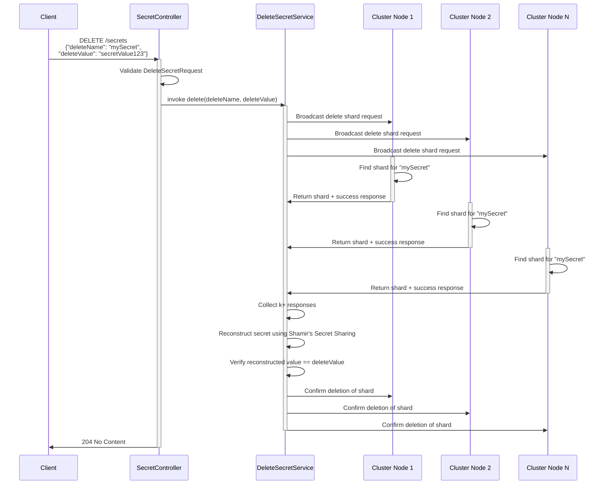
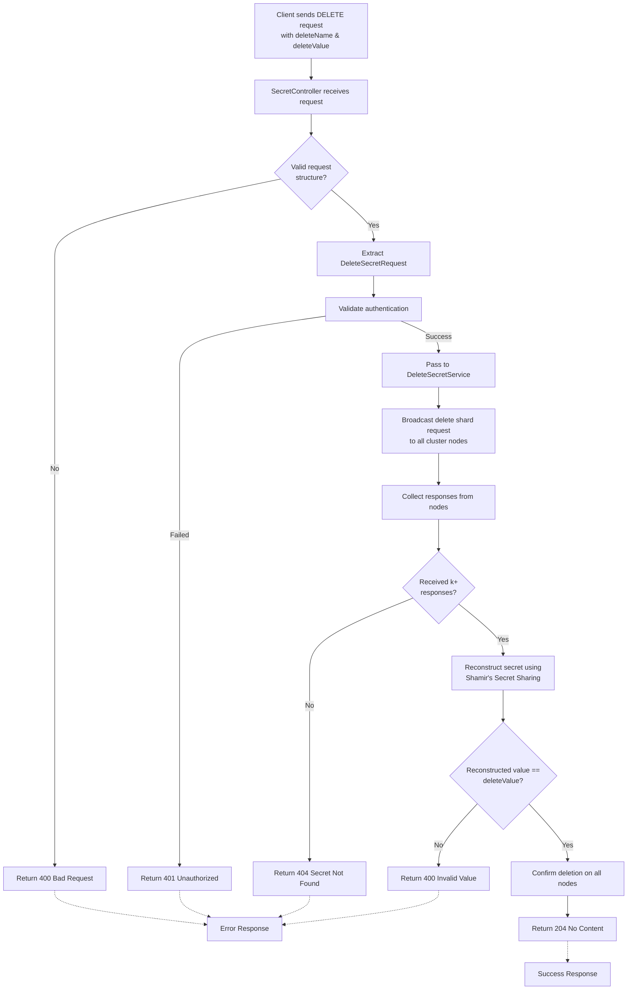

# Deleting a Secret

## Happy-Path Usage

In the Distributed Secrets Vault application, a client can delete a secret by sending an HTTP DELETE request to the endpoint `?`. The request must include a JSON body with the `DeleteSecretRequest` object, which contains two fields:
- `deleteName`: The name of the secret to delete.
- `deleteValue`: The current value of the secret, used for verification. (VERIFY THIS IS THE CORRECT PURPOSE OF THIS FIELD)

**Steps for the client:**
1. Authenticate with the system.
2. Construct the request body: `{"deleteName": "mySecret", "deleteValue": "currentSecretValue"}`.
3. Send the DELETE request to `?`.
4. On success, the server responds with HTTP status 204 (No Content), indicating the secret has been deleted without returning any body.

**Steps for the server:**
1. The `SecretController` receives the DELETE request and extracts the `DeleteSecretRequest` from the request body.
2. It validates the request and passes it to the `DeleteSecretService`.
3. The `DeleteSecretService` broadcasts the delete request to all nodes in the cluster.
4. Each node checks its local storage for a shard for the secret with the name `deleteName`. If found, it deletes the shard and responds with a success message. If not found, it responds with a not found message.
5. The `DeleteSecretService` collects responses from all nodes. If `k` or more nodes confirm the deletion, it reconstructs the secret using Shamir's Secret Sharing to verify the `deleteValue` matches the stored value before finalizing the deletion.
6. If the deletion is successful, the service returns a 204 No Content response to the client. If the secret is not found or the value does not match, it returns an appropriate error response.

### Sequence Diagram: Happy-Path Delete Flow

### Process Flowchart: Delete Operation Logic

## Potential Issues

Several issues can occur during the delete operation, leading to failures or unexpected behavior:
- **Secret Not Found (404)**: If the `deleteName` does not correspond to an existing secret, a `SecretNotFoundException` is thrown, resulting in a 404 response with an error message like "Secret not found". This prevents deletion of non-existent secrets.

- **Authentication Failure (401)**: If the client lacks proper authentication, an `AuthenticationFailedException` is raised, returning a 401 Unauthorized status.

- **Invalid Request (400)**: If the request body is malformed (e.g., missing `deleteName` or `deleteValue`), Spring Boot's validation may return a 400 Bad Request. Additionally, if the provided `deleteValue` does not match the stored value, the service could reject the request.
