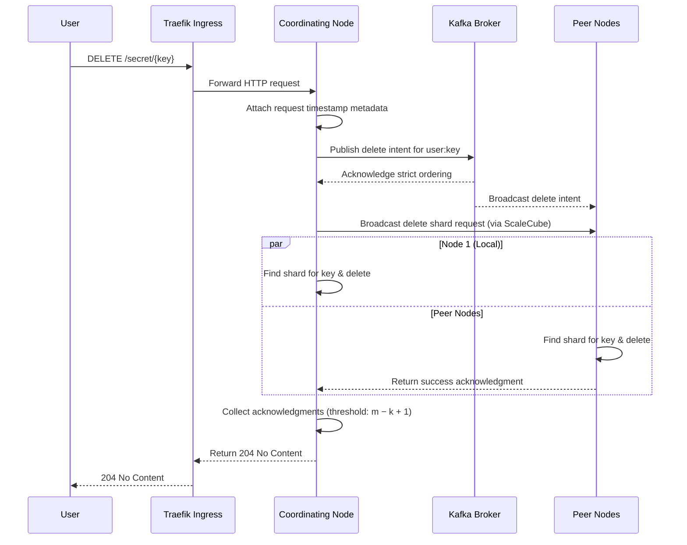

# Delete Secret

A client can delete a secret by sending a DELETE request specifying the secret key. The delete request is broadcast to all n nodes and is considered successful once at least m − k + 1 delete acknowledgments are received (ensuring fewer than k shards remain and the secret can no longer be reconstructed).

---

## Table of Contents

**Happy Path**

- [1. Delete one secret](#1-delete-one-secret)

**Error Cases**

- [2. Secret not found](#2-secret-not-found)
- [3. Authentication failure](#3-authentication-failure)
- [4. Invalid request](#4-invalid-request)

---

## 1. Delete one secret

- The client sends a DELETE request to the ingress gateway (Traefik), which routes it to a DSV Worker (acting as the Coordinating Node).
- The Coordinating Node attaches timestamp metadata and publishes a delete intent to the Kafka commit log.
- Kafka establishes strict ordering for the delete operation relative to any concurrent updates.
- The Coordinating Node broadcasts the delete command to all peer nodes (via ScaleCube).
- Each node checks its local storage for a shard matching the key, deletes it, and returns an acknowledgment.
- After m − k + 1 acknowledgments are received, the deletion is confirmed (ensuring fewer than k shards remain).
- **Response**: `204 No Content`

---

## 2. Secret not found

- The specified key does not correspond to any existing secret in the cluster.
- No node returns a shard for that key; the deletion threshold cannot be met.
- The client receives: "Secret not found".
- **Response**: `404 Not Found`

---

## 3. Authentication failure

- The client's credentials are missing, expired, or invalid.
- The request is rejected before reaching the cluster.
- The client receives: "Unauthorized".
- **Response**: `401 Unauthorized`

---

## 4. Invalid request

- The request is malformed, for example the key field is missing or empty.
- The controller rejects the request during validation before forwarding it.
- The client receives: "Bad request".
- **Response**: `400 Bad Request`
