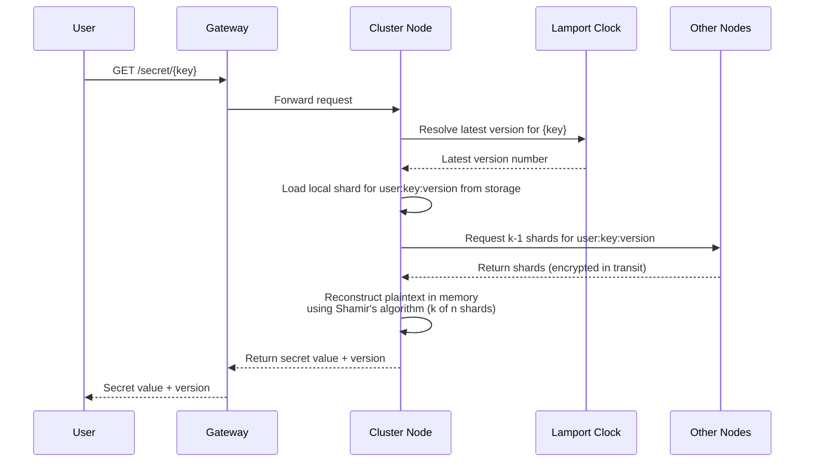
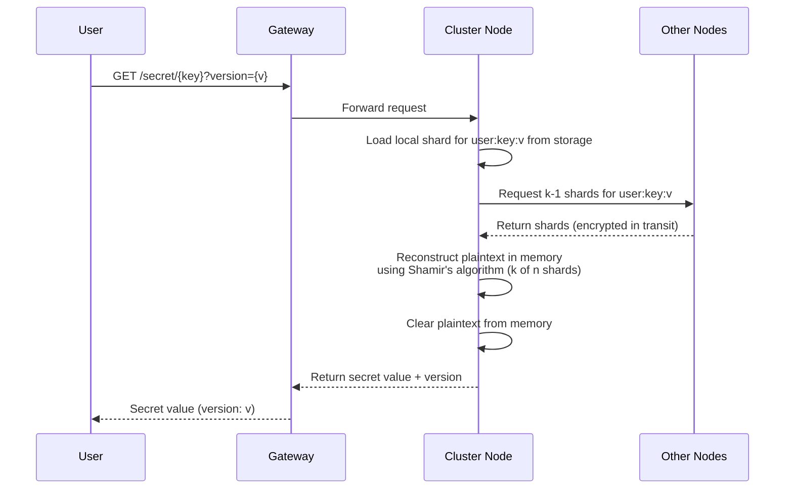
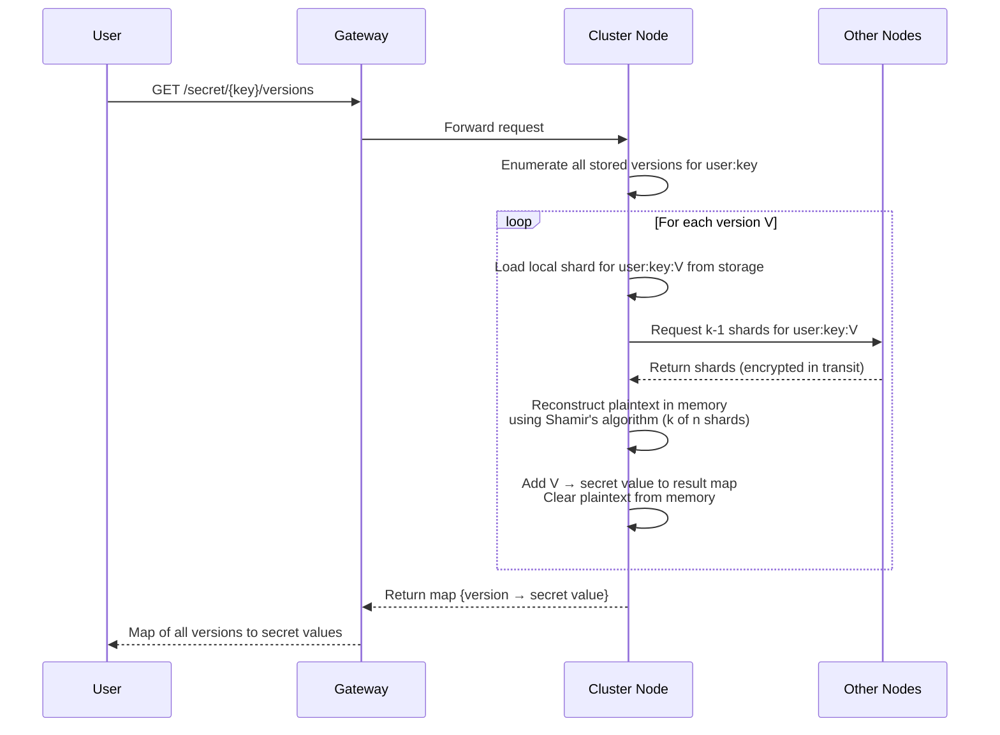

# Retrieve Secret(s)

A client may retrieve secrets in three ways:

- **Latest version** — omit the version parameter; the cluster resolves and returns the most recent version
- **Specific version** — supply an explicit version number to retrieve an exact historical snapshot
- **All versions** — request every stored version, receiving a map of version → secret value

In every case the receiving node collects at least k shards (the reconstruction threshold) from itself and peer nodes, rebuilds the plaintext exclusively in memory, and returns the value to the client. The plaintext is never written to durable storage.

---

## Table of Contents

**Happy Path**

- [1. Retrieve Latest Version](#1-retrieve-latest-version)
- [2. Retrieve Specific Version](#2-retrieve-specific-version)
- [3. Retrieve All Versions](#3-retrieve-all-versions)

**Error Cases**

- [4. Secret Not Found](#4-secret-not-found)
- [5. Version Not Found](#5-version-not-found)
- [6. Insufficient Shards](#6-insufficient-shards)
- [7. Not Authorized to Access Secret](#7-not-authorized-to-access-secret)
- [8. Gateway Unavailable](#8-gateway-unavailable)
- [9. Node Unavailable](#9-node-unavailable)
- [10. Lamport Clock Unavailable](#10-lamport-clock-unavailable)
- [11. Local Shard Read Failure](#11-local-shard-read-failure)
- [12. Version Enumeration Failure](#12-version-enumeration-failure)
- [13. Shard Reconstruction Failure](#13-shard-reconstruction-failure)

---

## Happy Paths

### 1. Retrieve Latest Version

- Client sends a GET request for a secret key without specifying a version
- Gateway forwards the request to any cluster node (leaderless routing)
- Receiving node consults the cluster-wide Lamport clock to resolve the current latest version number
- Node loads its own local shard for `user:key:latest-version` from durable storage
- Node requests k-1 additional shards from peer nodes
- Node reconstructs the plaintext secret in memory using Shamir's algorithm (k of n shards)
- Secret value is returned to the client; plaintext is cleared from memory immediately

---

### 2. Retrieve Specific Version

- Client sends a GET request for a secret key with an explicit version number
- Gateway forwards the request to any cluster node
- Receiving node skips version resolution — it uses the requested version directly
- Node loads its own local shard for `user:key:requested-version` from durable storage
- Node requests k-1 additional shards from peer nodes for the same version
- Node reconstructs the plaintext secret in memory using Shamir's algorithm (k of n shards)
- Secret value for the requested version is returned to the client; plaintext is cleared from memory

---

### 3. Retrieve All Versions

- Client sends a GET request for a secret key requesting all versions
- Gateway forwards the request to any cluster node
- Receiving node queries its local storage to enumerate all known versions of `user:key`
- For each version, the node loads its local shard and requests k-1 shards from peers
- Each version's plaintext is reconstructed independently in memory and added to the result map
- Plaintext for each version is cleared from memory as soon as it is added to the map
- Node returns the complete map of version → secret value to the client

---

## Error Cases

### 4. Secret Not Found

- **When it happens**: The key has no recorded versions for the authenticated user.
- **Handling**:
    - Receiving node checks local metadata first, then consults peers only if metadata is uncertain.
    - If no node can confirm any version for the key, return `404 Not Found` with a stable error code.
    - Do not leak existence across tenants; errors should be scoped to the authenticated user.
    - Cache the negative lookup briefly to reduce repeated fan-out.

---

### 5. Version Not Found

- **When it happens**: The key exists, but the requested version does not.
- **Handling**:
    - Validate the requested version against version metadata (local + quorum) before shard fetch.
    - If the version is missing in a majority of metadata sources, return `404 Not Found`.
    - Include the latest known version in the response body (not headers) when safe to help clients recover.
    - Avoid reconstruct attempts for unknown versions to reduce load.

---

### 6. Insufficient Shards

- **When it happens**: Fewer than k shards are available due to node loss, partition, or read failures.
- **Handling**:
    - Attempt reads from additional peers until the shard budget is exhausted or k shards are collected.
    - If k shards cannot be assembled, return `503 Service Unavailable` with a retryable error code.
    - Include a `Retry-After` hint based on recent cluster health.
    - Record a quorum health event for operator visibility.

---

### 7. Not Authorized to Access Secret

- **When it happens**: Authentication fails or authorization rules deny access.
- **Handling**:
    - Reject early at the gateway when possible; nodes still enforce authorization on every request.
    - Return `401 Unauthorized` for invalid/expired credentials, `403 Forbidden` for valid but insufficient access.
    - Do not indicate whether the secret exists.
    - Audit log the denial with request metadata (no plaintext).

---

### 8. Gateway Unavailable

- **When it happens**: The gateway is unreachable or returns errors to the client.
- **Handling**:
    - Clients should retry with exponential backoff and jitter.
    - Gateways should be stateless and horizontally scaled behind a load balancer.
    - Use health checks and circuit breakers to avoid routing to unhealthy gateways.
    - Return `503 Service Unavailable` when the gateway is overloaded.

---

### 9. Node Unavailable

- **When it happens**: The target node is down or unreachable.
- **Handling**:
    - Gateway retries on another node; routing is leaderless.
    - Node-to-node shard requests use timeouts and fall back to other peers.
    - If a receiving node cannot reach enough peers to reach k shards, treat as insufficient shards.
    - Track node health and quarantine flapping nodes temporarily.

---

### 10. Lamport Clock Unavailable

- **When it happens**: The service used to resolve the latest version is unreachable or inconsistent.
- **Handling**:
    - For latest-version requests, attempt a quorum read of version metadata as a fallback.
    - If the latest version cannot be resolved safely, return `503 Service Unavailable` with a retryable error code.
    - For explicit version requests, bypass the clock entirely.
    - Emit a health signal for clock availability.

---

### 11. Local Shard Read Failure

- **When it happens**: Local storage returns an error or corrupted shard data.
- **Handling**:
    - Retry the local read once if the error is transient.
    - If still failing, fetch a replacement shard from a peer if redundancy allows.
    - If k shards can still be assembled, proceed; otherwise return `503 Service Unavailable`.
    - Mark the local shard as suspect and trigger background repair.

---

### 12. Version Enumeration Failure

- **When it happens**: The node cannot list versions due to metadata or storage errors.
- **Handling**:
    - Retry with bounded backoff and, if configured, query peer metadata.
    - If enumeration still fails, return `503 Service Unavailable` with a retryable error code.
    - Do not partially return results unless explicitly requested by the client.
    - Emit an error metric tagged by storage backend.

---

### 13. Shard Reconstruction Failure

- **When it happens**: Collected shards fail integrity checks or reconstruction cannot complete.
- **Handling**:
    - Validate shard checksums and reject mismatched shards.
    - Attempt to replace bad shards by querying additional peers.
    - If reconstruction still fails, return `500 Internal Server Error` for integrity failures or `503` if insufficient good shards.
    - Log and quarantine offending shards for investigation.
