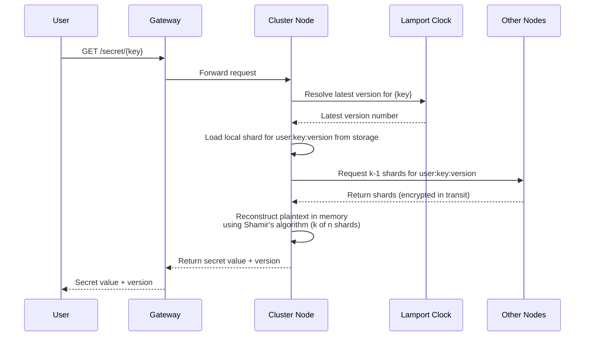
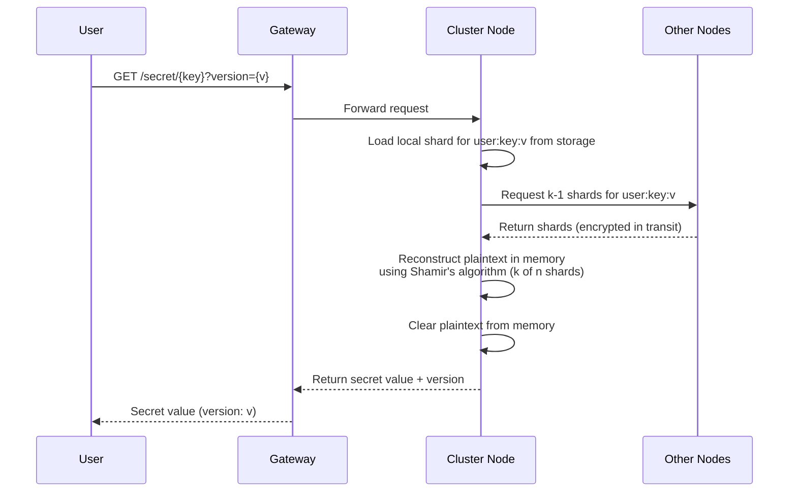
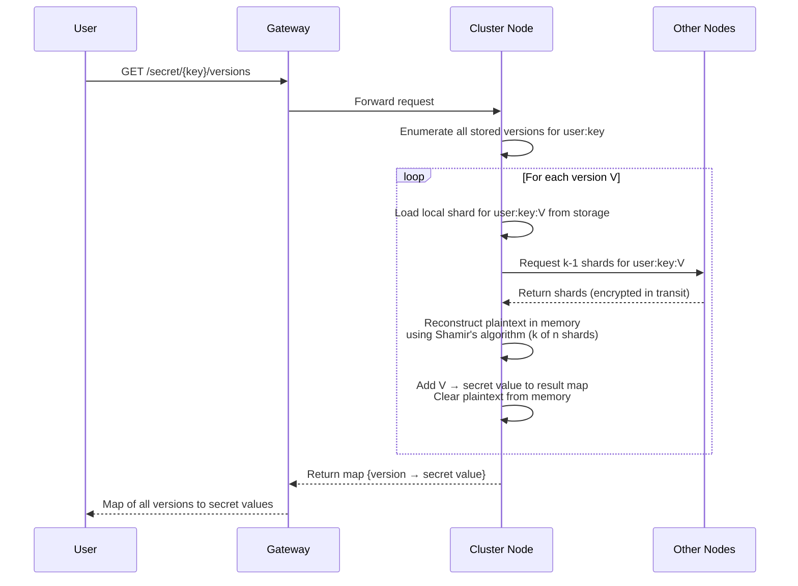

# Retrieve Secret(s)

A client may retrieve secrets in three ways:

- **Latest version** — omit the version parameter; the cluster resolves and returns the most recent version
- **Specific version** — supply an explicit version number to retrieve an exact historical snapshot
- **All versions** — request every stored version, receiving a map of version → secret value

In every case the receiving node collects at least k shards (the reconstruction threshold) from itself and peer nodes, rebuilds the plaintext exclusively in memory, and returns the value to the client. The plaintext is never written to durable storage.

---

## Table of Contents

**Happy Path**

- [1. Retrieve Latest Version](#1-retrieve-latest-version)
- [2. Retrieve Specific Version](#2-retrieve-specific-version)
- [3. Retrieve All Versions](#3-retrieve-all-versions)

**Error Cases**

- [4. Secret Not Found](#4-secret-not-found)
- [5. Version Not Found](#5-version-not-found)
- [6. Insufficient Shards](#6-insufficient-shards)
- [7. Not Authorized to Access Secret](#7-not-authorized-to-access-secret)
- [8. Gateway Unavailable](#8-gateway-unavailable)
- [9. Node Unavailable](#9-node-unavailable)
- [10. Lamport Clock Unavailable](#10-lamport-clock-unavailable)
- [11. Local Shard Read Failure](#11-local-shard-read-failure)
- [12. Version Enumeration Failure](#12-version-enumeration-failure)
- [13. Shard Reconstruction Failure](#13-shard-reconstruction-failure)

---

## Happy Paths

### 1. Retrieve Latest Version

- Client sends a GET request for a secret key without specifying a version
- Gateway forwards the request to any cluster node (leaderless routing)
- Receiving node consults the cluster-wide Lamport clock to resolve the current latest version number
- Node loads its own local shard for `user:key:latest-version` from durable storage
- Node requests k-1 additional shards from peer nodes
- Node reconstructs the plaintext secret in memory using Shamir's algorithm (k of n shards)
- Secret value is returned to the client; plaintext is cleared from memory immediately

---

### 2. Retrieve Specific Version

- Client sends a GET request for a secret key with an explicit version number
- Gateway forwards the request to any cluster node
- Receiving node skips version resolution — it uses the requested version directly
- Node loads its own local shard for `user:key:requested-version` from durable storage
- Node requests k-1 additional shards from peer nodes for the same version
- Node reconstructs the plaintext secret in memory using Shamir's algorithm (k of n shards)
- Secret value for the requested version is returned to the client; plaintext is cleared from memory

---

### 3. Retrieve All Versions

- Client sends a GET request for a secret key requesting all versions
- Gateway forwards the request to any cluster node
- Receiving node queries its local storage to enumerate all known versions of `user:key`
- For each version, the node loads its local shard and requests k-1 shards from peers
- Each version's plaintext is reconstructed independently in memory and added to the result map
- Plaintext for each version is cleared from memory as soon as it is added to the map
- Node returns the complete map of version → secret value to the client

---

## Error Cases

### 4. Secret Not Found

TODO

---

### 5. Version Not Found

TODO

---

### 6. Insufficient Shards

TODO

---

### 7. Not Authorized to Access Secret

TODO

---

### 8. Gateway Unavailable

TODO

---

### 9. Node Unavailable

TODO

---

### 10. Lamport Clock Unavailable

TODO

---

### 11. Local Shard Read Failure

TODO

---

### 12. Version Enumeration Failure

TODO

---

### 13. Shard Reconstruction Failure

TODO
