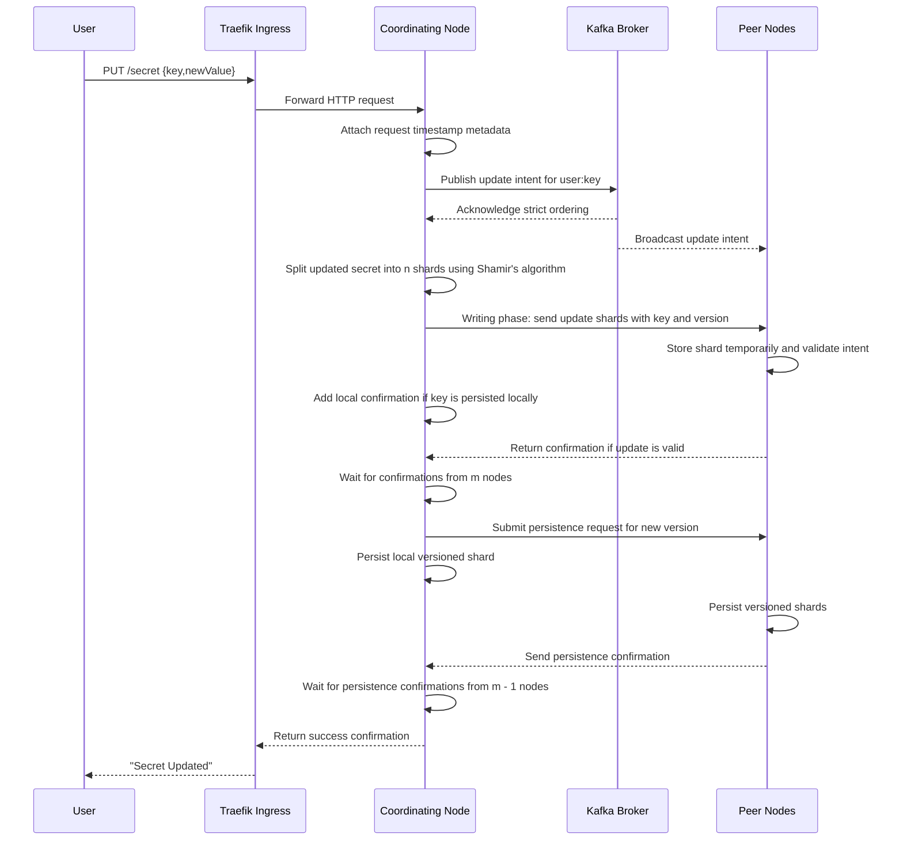
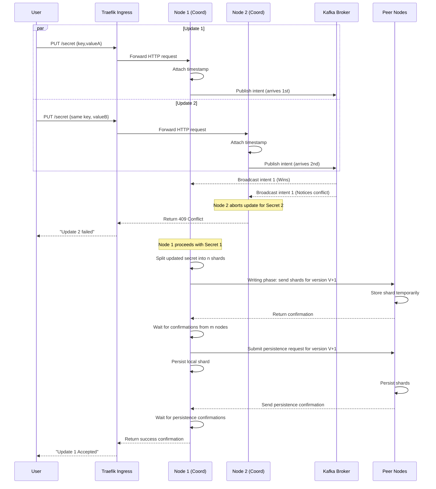

# Update Secret

A client can update a secret only if a secret with that key already exists. The update creates a new version with a fresh timestamp and is not durably persisted until confirmations are received from m nodes (where m is between k and n).

---

## Table of Contents

**Happy Path**

- [1. Update one secret](#1-update-one-secret)
- [2. Concurrent updates to the same secret](#2-concurrent-updates-to-the-same-secret)

**Error Cases**

- [3. Ingress unable to forward request to node](#3-ingress-unable-to-forward-request-to-node)
- [4. Coordinating Node metadata missing or invalid](#4-coordinating-node-metadata-missing-or-invalid)
- [5. M nodes do not send back confirmation for receiving update](#5-m-nodes-do-not-send-back-confirmation-for-receiving-update)
- [6. M nodes do not send back confirmation for persisting update](#6-m-nodes-do-not-send-back-confirmation-for-persisting-update)
- [7. Client does not receive response](#7-client-does-not-receive-response)

---

## 1. Update one secret

- A client submits an updated secret through the ingress gateway (Traefik), which routes it to a DSV Worker (acting as the Coordinating Node).
- The Coordinating Node validates that the key already exists locally, attaches timestamp metadata, and starts the two-phase commit process via Kafka.
- In the **ordering phase**, the node publishes an update intent to the Kafka commit log. All nodes consume this log to establish a globally agreed-upon order.
- In the **writing phase**, the Coordinating Node splits the updated secret into n shards using Shamir's algorithm, sends update shards to peer nodes (via ScaleCube), and each node stages its shard in temporary in-memory state.
- The Coordinating Node then submits a persistence request for the new version to all nodes and returns success after m persistence confirmations.
- **Response**: `200 OK`

---

## 2. Concurrent updates to the same secret

- Two update requests for the same key may be processed concurrently by different nodes.
- Instead of peer-to-peer voting, the nodes publish their update intents to Kafka.
- Kafka strictly orders the requests. The request that appears first in the commit log continues through quorum and persistence as version V+1.
- The node handling the later request observes the conflict from the commit log and aborts or prompts a retry for version V+2.
- The client receives success for the accepted update and an error for the rejected one.
- **Response**: `200 OK` for the accepted update; `409 Conflict` for the rejected update

---

## 3. Ingress unable to forward request to node

- The Traefik ingress attempts to forward an update request into the cluster so a node can pick it up.
- If forwarding times out, the ingress retries with another node based on load balancing configuration.
- After repeated timeouts, the ingress returns a failure.
- **Response**: `503 Service Unavailable`

---

## 4. Coordinating Node metadata missing or invalid

- The coordinating node requires a valid timestamp and metadata to publish the intent to Kafka.
- If metadata generation fails, update cannot continue.
- The client receives: "Secret update error - invalid request metadata".
- **Response**: `503 Service Unavailable`

---

## 5. M nodes do not send back confirmation for receiving update

- After update-shard distribution, the node must receive receive-phase confirmations from at least m nodes.
- If quorum is not reached before timeout, the node retries and updates the confirmation count.
- If quorum is still not reached, update fails with: "Secret update failed - not enough confirmations from nodes".
- **Response**: `503 Service Unavailable`

---

## 6. M nodes do not send back confirmation for persisting update

- The operation reaches the persist phase but does not receive persistence confirmations from m nodes.
- The node retries confirmation collection; if the threshold is still unmet, it issues cleanup deletes for partially persisted new-version shards.
- The operation then fails with: "Secret update failed - not enough confirmations from nodes".
- **Response**: `503 Service Unavailable`

---

## 7. Client does not receive response

- The secret update flow can complete on the cluster, but the client may not receive the final response.
- After client-side timeout, the client retries the request.
- Retries must be handled safely against already persisted versions or in-progress updates.
- **Response**: `200 OK` (sent by server; not received by client due to timeout)
