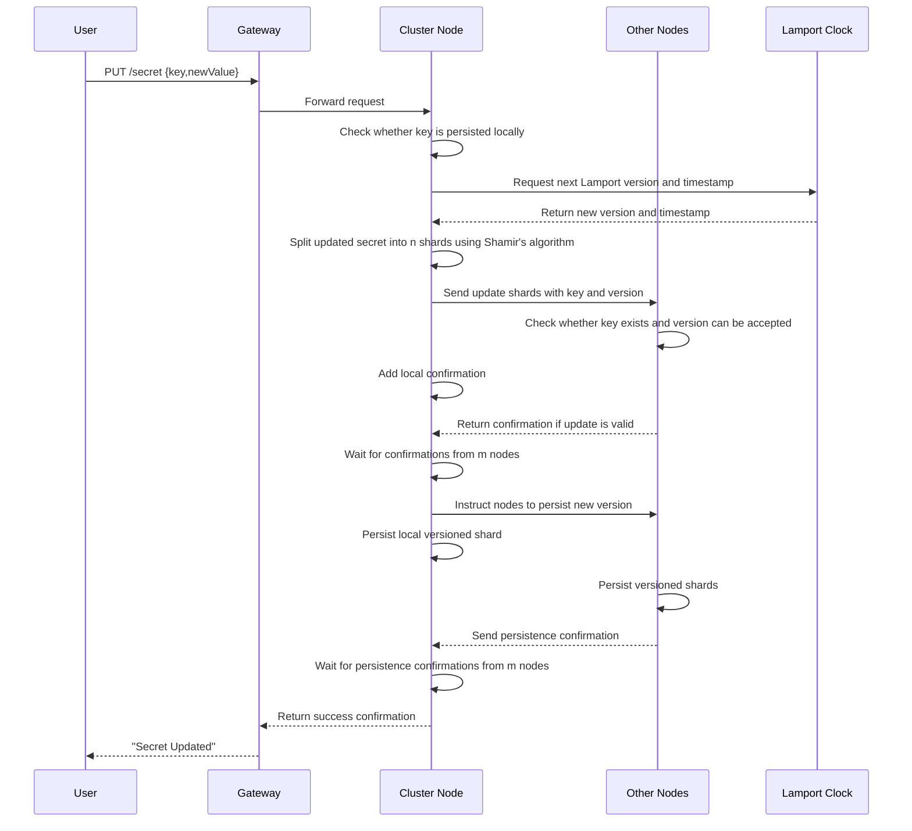
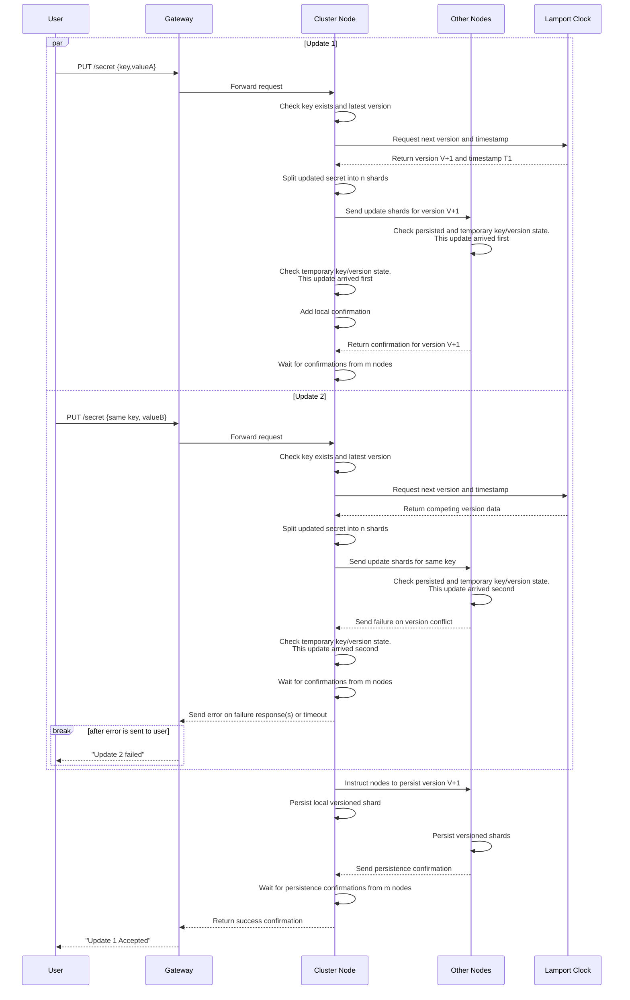

# Update Secret

A client can update a secret only if a secret with that key already exists. The update creates a new version with a fresh timestamp and is not committed until confirmations are received from m nodes (where m is between k and n).

---

## Table of Contents

**Happy Path**

- [1. Update one secret](#1-update-one-secret)
- [2. Concurrent updates to the same secret](#2-concurrent-updates-to-the-same-secret)

**Error Cases**
- [3. Gateway unable to forward request to node](#3-gateway-unable-to-forward-request-to-node)
- [4. Key does not exist on the receiving node](#4-key-does-not-exist-on-the-receiving-node)
- [5. Key does not exist on another node](#5-key-does-not-exist-on-another-node)
- [6. Clock does not return version](#6-clock-does-not-return-version)
- [7. M nodes do not send back confirmation for receiving update](#7-m-nodes-do-not-send-back-confirmation-for-receiving-update)
- [8. M nodes do not send back confirmation for persisting update](#8-m-nodes-do-not-send-back-confirmation-for-persisting-update)
- [9. Client does not receive response](#9-client-does-not-receive-response)
---

## 1. Update one secret

- A client updates a secret through the gateway, which forwards the request to any cluster node.
- The node validates that the key already exists, gets a Lamport version and timestamp for the next version, and splits the updated secret into n shards.
- Shards are distributed and temporarily stored; update proceeds only after m nodes confirm the key exists and the incoming version can be accepted.
- The node then commits the new version across nodes and returns success after m persistence confirmations.

---

## 2. Concurrent updates to the same secret

- Two update requests for the same key may be processed concurrently by different nodes.
- Nodes and peers use persisted state, temporary state, and Lamport ordering to resolve which version is accepted first.
- The earlier update continues through quorum and persistence, while the later conflicting update is rejected or retried with a newer version.
- The client receives success for the accepted update and an error for the rejected one.

---

## 3. Gateway unable to forward request to node

- The gateway attempts to forward an update request to a cluster node.
- If forwarding times out, the gateway retries with another node.
- After repeated timeouts, the gateway returns: "Could not forward request to node".

---

## 4. Key does not exist on the receiving node

- The receiving node checks local persisted data before creating an updated version.
- If the key does not exist locally, update is rejected immediately.
- The client receives: "Secret update failed - key does not exist".

---

## 5. Key does not exist on another node

- The request may pass the initial local check but fail during peer validation.
- If peers cannot confirm existing key state or report that the key is missing, the update operation is aborted.
- The client receives: "Secret update failed - key does not exist", and temporary update shards are cleaned up.

---

## 6. Clock does not return version

- The node requests the next Lamport version and timestamp before splitting and distributing shards.
- If the clock does not return version metadata before timeout, update cannot continue.
- The client receives: "Secret update error - clock error".

---

## 7. M nodes do not send back confirmation for receiving update

- After update-shard distribution, the node must receive receive-phase confirmations from at least m nodes.
- If quorum is not reached before timeout, the node retries and updates the confirmation count.
- If quorum is still not reached, update fails with: "Secret update failed - not enough confirmations from nodes".

---

## 8. M nodes do not send back confirmation for persisting update

- The operation reaches the persist phase but does not receive persistence confirmations from m nodes.
- The node retries confirmation collection; if the threshold is still unmet, it issues cleanup deletes for partially persisted new-version shards.
- The operation then fails with: "Secret update failed - not enough confirmations from nodes".

---

## 9. Client does not receive response

- The secret update flow can complete on the cluster, but the client may not receive the final response.
- After client-side timeout, the client retries the request.
- Retries must be handled safely against already persisted versions or in-progress updates.