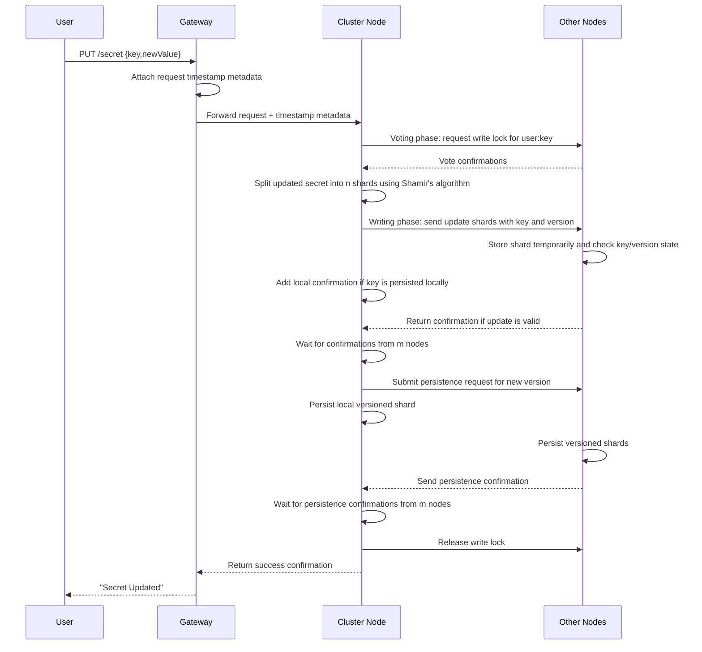
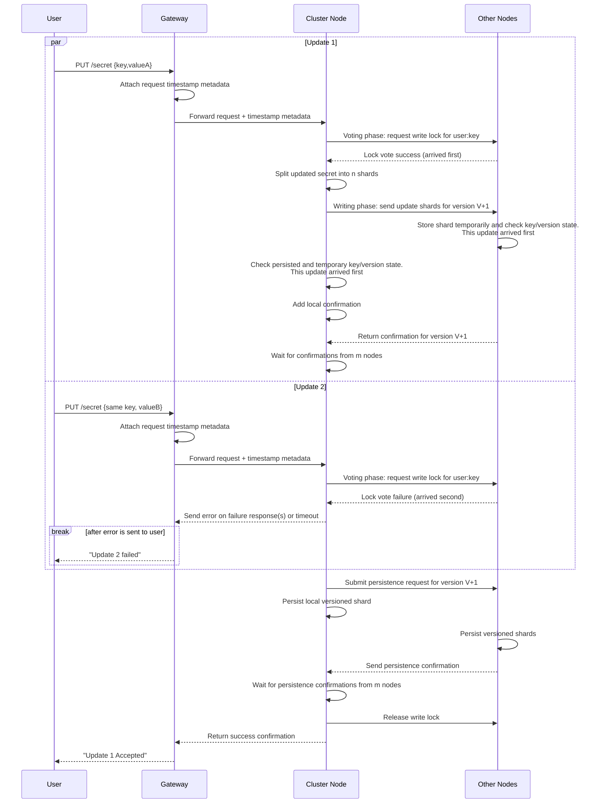

# Update Secret

A client can update a secret only if a secret with that key already exists. The update creates a new version with a fresh timestamp and is not durably persisted until confirmations are received from m nodes (where m is between k and n).

---

## Table of Contents

**Happy Path**

- [1. Update one secret](#1-update-one-secret)
- [2. Concurrent updates to the same secret](#2-concurrent-updates-to-the-same-secret)

**Error Cases**

- [3. Gateway unable to forward request to node](#3-gateway-unable-to-forward-request-to-node)
- [4. Gateway metadata missing or invalid](#4-gateway-metadata-missing-or-invalid)
- [5. M nodes do not send back confirmation for receiving update](#5-m-nodes-do-not-send-back-confirmation-for-receiving-update)
- [6. M nodes do not send back confirmation for persisting update](#6-m-nodes-do-not-send-back-confirmation-for-persisting-update)
- [7. Client does not receive response](#7-client-does-not-receive-response)

---

## 1. Update one secret

- A client submits an updated secret through the gateway, and the gateway forwards the request into the cluster where one node picks it up.
- The receiving node validates that the key already exists, then starts two-phase commit for `user:key`.
- In the **voting phase**, nodes vote on write-lock ownership for the key and block competing writes until lock release.
- In the **writing phase**, the lock owner splits the updated secret into n shards and sends update shards to peers, where each node stages its shard in temporary in-memory state.
- The receiving node then submits a persistence request for the new version to all nodes and returns success after m persistence confirmations.
- **Response**: `200 OK`

---

## 2. Concurrent updates to the same secret

- Two update requests for the same key may be processed concurrently by different nodes.
- Nodes and peers use persisted state, temporary state, and voting-phase lock ownership to resolve which update proceeds first.
- The earlier update continues through quorum and persistence, while the later conflicting update is rejected or retried with a newer version.
- The client receives success for the accepted update and an error for the rejected one.
- **Response**: `200 OK` for the accepted update; `409 Conflict` for the rejected update

---

## 3. Gateway unable to forward request to node

- The gateway attempts to forward an update request into the cluster so a node can pick it up.
- If forwarding times out, the gateway retries with another node.
- After repeated timeouts, the gateway returns: "Could not forward request to node".
- **Response**: `503 Service Unavailable`

---

## 4. Gateway metadata missing or invalid

- The node requires gateway-attached timestamp metadata before starting write coordination.
- If metadata is missing or invalid, update cannot continue.
- The client receives: "Secret update error - invalid request metadata".
- **Response**: `503 Service Unavailable`

---

## 5. M nodes do not send back confirmation for receiving update

- After update-shard distribution, the node must receive receive-phase confirmations from at least m nodes.
- If quorum is not reached before timeout, the node retries and updates the confirmation count.
- If quorum is still not reached, update fails with: "Secret update failed - not enough confirmations from nodes".
- **Response**: `503 Service Unavailable`

---

## 6. M nodes do not send back confirmation for persisting update

- The operation reaches the persist phase but does not receive persistence confirmations from m nodes.
- The node retries confirmation collection; if the threshold is still unmet, it issues cleanup deletes for partially persisted new-version shards.
- The operation then fails with: "Secret update failed - not enough confirmations from nodes".
- **Response**: `503 Service Unavailable`

---

## 7. Client does not receive response

- The secret update flow can complete on the cluster, but the client may not receive the final response.
- After client-side timeout, the client retries the request.
- Retries must be handled safely against already persisted versions or in-progress updates.
- **Response**: `200 OK` (sent by server; not received by client due to timeout)
