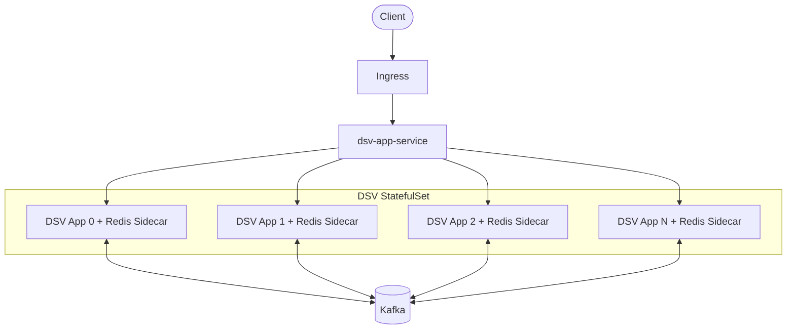

# Kubernetes Architecture and Configuration

The Kubernetes deployment runs DSV as a leaderless app cluster with per-node Redis sidecars and a Kafka broker.

## High-Level Architecture



## DSV App and Redis

The app runs as a StatefulSet. Each pod includes:

- a Spring Boot DSV container
- a Redis sidecar on `localhost:6379`
- a PVC mounted into Redis for durable shard storage

This keeps shard storage local to the DSV pod while still allowing Kubernetes to reschedule pods with their persistent volumes.

## Cluster Discovery

`dsv-app-headless` is a headless service that returns DNS records for app pods. ScaleCube uses:

- `SEED_DNS_HOST=dsv-app-headless.default.svc.cluster.local`
- `SEED_DNS_PORT=4801`
- `CLUSTER_PORT=4801`

The app service `dsv-app-service` separately provides load-balanced HTTP traffic.

## Kafka

Kafka runs as a single-broker KRaft StatefulSet in the current manifests. DSV app pods connect through:

```text
KAFKA_BOOTSTRAP_SERVERS=kafka.default.svc.cluster.local:9092
```

## Testing Environment

`k8s/testing` is intended for Docker Desktop, Minikube, or K3d. It runs three DSV app replicas without production node-affinity constraints.

```bash
kubectl apply -f k8s/testing/
kubectl get pods -w
```

## Production Environment

`k8s/production` keeps scheduling controls for a multi-node target:

- app pods avoid control-plane nodes
- app pods use pod anti-affinity to spread across worker nodes
- the app StatefulSet requests up to 12 replicas

```bash
kubectl apply -f k8s/production/
```
