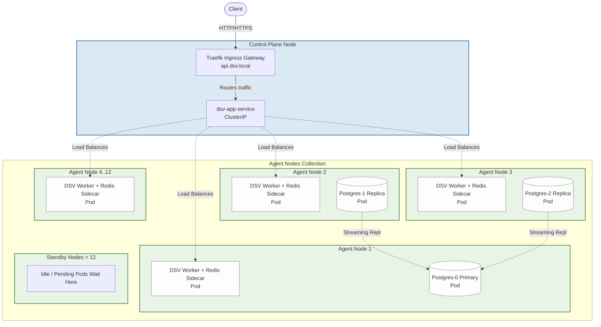
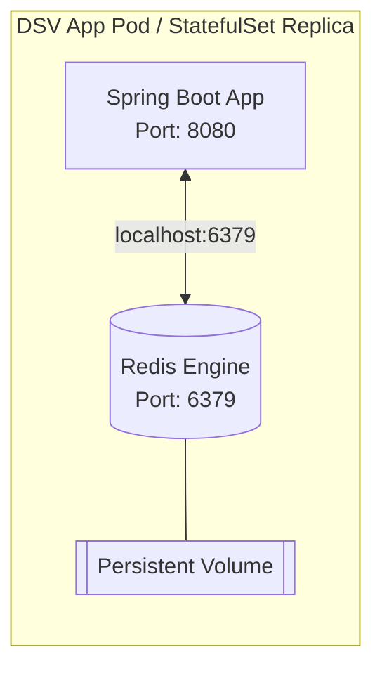
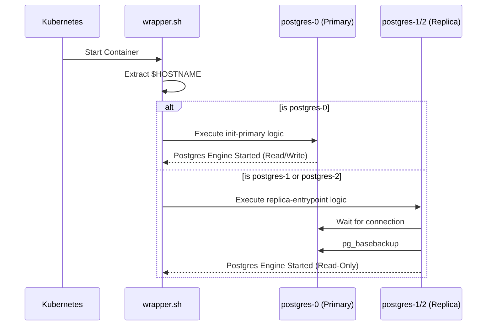

# Kubernetes Architecture & Configuration

This document provides an in-depth look at how the Distributed Secrets Vault (DSV) is deployed on Kubernetes (specifically optimized for K3s). The Kubernetes orchestration is designed to enforce strict hardware utilization limits, physical architecture constraints, and high-availability database replication.

---

## 1. High-Level Architecture

The cluster is distinctly divided into **Control Plane Node(s)** and **Agent Nodes**. Workloads (DSV App and Postgres databases) are entirely segregated from the Control Plane to ensure networking and load-balancing performance is not impacted by heavy data processing.



---

## 2. Workload Segregation

We enforce the distinction between Control Plane and Agent Nodes using Kubernetes **Node Affinity** rules. By explicitly denying placement on nodes labeled as `node-role.kubernetes.io/control-plane`, we guarantee the Control Plane handles only API ingresses and cluster state management.

```yaml
# Present on all Workload Pods (DSV Worker & Postgres)
affinity:
  nodeAffinity:
    requiredDuringSchedulingIgnoredDuringExecution:
      nodeSelectorTerms:
        - matchExpressions:
            - key: node-role.kubernetes.io/control-plane
              operator: DoesNotExist
```

---

## 3. Distributed Secrets Vault Worker (App + Redis)

The primary secret sharing application is deployed as a `StatefulSet` with an upper bound of 12 replicas.

### The Sidecar Model
Because the DSV application expects a tightly coupled Redis instance for persistent secret recovery and fast in-memory queueing, Redis is deployed as a **Sidecar** to the DSV Spring Boot application. They share the same Pod, meaning they share the `localhost` network space. The DSV application can always communicate with its dedicated Redis cache at `localhost:6379`.



### Resource Limits and Node Affinity
To enforce a strict **one worker per physical node** rule, we implement a `podAntiAffinity` constraint keyed to the `kubernetes.io/hostname`.

This limits deployment logic to:
* **Max 12 Nodes:** The StatefulSet requests exactly 12 replicas.
* **Insufficient physical hardware:** If the cluster only has 5 agent nodes, 5 Pods are scheduled, and the remaining 7 request "Standby" mode in the `Pending` state.
* **Too much physical hardware:** If there are 15 agent nodes, 12 receive Pods. The other 3 remain empty "Standby" nodes ready to take over instantly if an active node fails.

---

## 4. PostgreSQL Cluster Deployment

The PostgreSQL service utilizes a `StatefulSet` capped at exactly 3 replicas. Similar to the DSV app, it has a strict `podAntiAffinity` constraint to distribute the primary and two replicas across 3 independent physical agent nodes.

### Intelligent Primary/Replica Discovery
To translate the heavy Docker shell scripts into a unified Kubernetes deployment, the Postgres `StatefulSet` mounts a bash wrapper via a `ConfigMap`. Kubernetes organically names StatefulSet pods sequentially: `postgres-0`, `postgres-1`, `postgres-2`.

The wrapper script automatically interprets the current Pod's hostname:



Because of this wrapper, there is no need for separate `Primary` and `Replica` configuration files—Kubernetes self-organizes the database roles seamlessly.

---

## 5. DNS and Cluster Discovery

To facilitate internal communications without going through the external ingress gateway, the manifests rely on **Headless Services**. 

A standard Kubernetes Service (like `dsv-app-service`) provides a single IP that load-balances across all healthy pods. A Headless Service (`ClusterIP: None`) bypasses the proxy and returns the raw A-records for *every matching Pod endpoint*.

* `dsv-app-headless`: Allows an internal node to fetch the raw IPs of all other agent nodes for Gossip protocols or internal synchronizations.
* `postgres-headless`: Allows the application layer to reliably locate `postgres-0.postgres-headless.default.svc.cluster.local` as the permanent primary database URL.

---

## 6. Testing Environments

To facilitate local testing via Docker Desktop, Minikube, or K3d without needing a multi-node architecture, the `k8s/testing` directory contains versions of these YAML files with the `podAntiAffinity` and `nodeAffinity` constraints stripped out, and the replica counts reduced to `1`. 

Because of the intelligent Postgres wrapper, scaling `postgres` to `1` replica simply builds the `postgres-0` StatefulSet and seamlessly behaves as a standalone database!