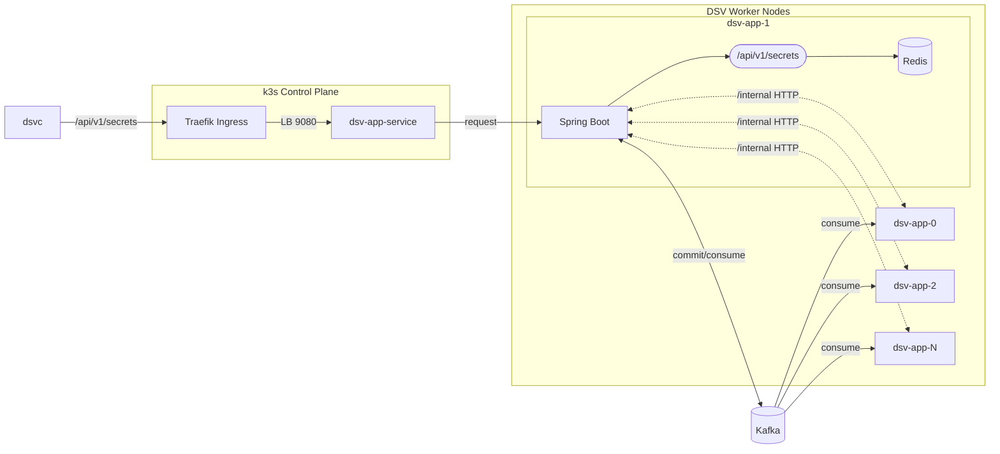

```mermaid
flowchart LR
  dsvc["dsvc"]

  subgraph controlPlane[k3s Control Plane]
    traefik[Traefik Ingress]
    appService[dsv-app-service]
    traefik -->|LB 9080| appService
  end

  dsvc -->|/api/v1/secrets| traefik

  subgraph workerNodes[DSV Worker Nodes]
    node0[dsv-app-0]
    node2[dsv-app-2]
    nodeN[dsv-app-N]

    subgraph selectedNode[dsv-app-1]
      springBoot[Spring Boot]
      secretController(["/api/v1/secrets"])
      redis[(Redis)]
      springBoot --> secretController
      secretController --> redis
    end
  end

  appService -->|request| springBoot
  node0 <-.->|/internal HTTP| springBoot
  node2 <-.->|/internal HTTP| springBoot
  nodeN <-.->|/internal HTTP| springBoot

  kafka[(Kafka)]
  springBoot <-->|commit/consume| kafka
  kafka -->|consume| node0
  kafka -->|consume| node2
  kafka -->|consume| nodeN
```
